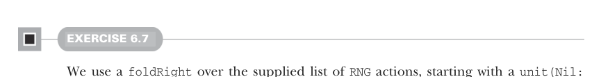

# Страница 0165
[<- Страница 0164](./page-0164) | [Индекс страниц](./) | [Страница 0166 ->](./page-0166)

> Часть 1: Введение в функциональное программирование / Глава 6: Чисто функциональное состояние / Ответы на упражнения 6.8



#### УПРАЖНЕНИЕ 6.7

Мы берём `foldRight` по поданному списку `RNG`-акшенов, стартуя с `unit(Nil:` `List[A])` — это такая `RNG`-акция, которая проглатывает `RNG`-параметр, не тратя на него ни хуя, и возвращает пустой список. Для каждого экшена из оригинального списка мы вычисляем выход типа `Rand[List[A]]`, юзая входной элемент типа `Rand[A]` и накопленный `Rand[List[A]]`. `map2` мы пихаем, чтоб слепить эти акшены в новый, конся выход первого экшена на хвост выходного списка накопленного:

```scala
def sequence[A](rs: List[Rand[A]]): Rand[List[A]] =
rs.foldRight(unit(Nil: List[A]))((r, acc) => map2(r, acc)(_ :: _))
```

Это пиздец как похоже на определение `sequence` для `Option` из упражнения 4.4 — прям как дежавю из прошлого проекта:

```scala
def sequence[A](as: List[Option[A]]): Option[List[A]] =
as.foldRight(Some(Nil): Option[List[A]])((a, acc) => map2(a, acc)(_ :: _))
```

Эта схожесть намекает на нераскрытую абстракцию — такую хуйню, которая позволит наклепать `sequence` один раз под кучу типов данных, без копипасты по всему репозиторию. Вернёмся к этой жемчужине в 12-й главе. Наконец, `ints` определяем через `sequence`: генерим список нужного размера и сетим каждый элемент в `int`-значение, которое мы раньше накатали, чтоб не изобретать велосипед заново:

```scala
def ints(count: Int): Rand[List[Int]] =
sequence(List.fill(count)(int))
```


#### УПРАЖНЕНИЕ 6.8

Как и с `map2`, возвращаем анонимную функцию — чтоб добраться до стартового `RNG`. Этот начальный `RNG` кидаем в поданный экшен, получаем значение типа `A` и свежий `RNG`. Потом этот `A`-выход пихаем в поданную функцию `f`, и вуаля — `Rand[B]`. Наконец, наш ранний выход `RNG` лепим к этому `Rand[B]`, и выходит `(B,` `RNG)`. Если б не вызвали функцию из `f(a)` (а это значение типа `Rand[B]`), компилятор бы нас жёстко потроллил ошибкой:

```scala
def flatMap[A, B](r: Rand[A])(f: A => Rand[B]): Rand[B] =
rng0 =>
val (a, rng1) = r(rng0)
f(a)(rng1)
```

`nonNegativeLessThan` реализуем, вызвав `flatMap` на `nonNegativeInt` и сунув анонимку, которая возвращает `Rand[Int]`. Наткнулись на годное значение по критериям — возвращаем его, но сначала конвертим из `Int` в `Rand[Int]` через `unit`; иначе, если выход не катит, рекурсивно долбим `nonNegativeLessThan(n)`, чтоб нагенерить новый:

[<- Страница 0164](./page-0164) | [Индекс страниц](./) | [Страница 0166 ->](./page-0166)
