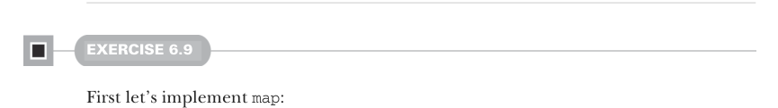
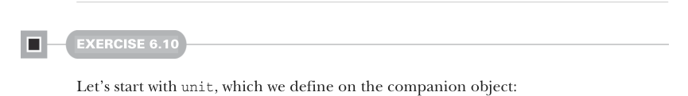

# Страница 0166

[<- Страница 0165](./page-0165)  
[Индекс страниц](./)  
[Страница 0167 ->](./page-0167)

> Часть 1: Введение в функциональное программирование / Глава 6: Чисто функциональное состояние / 6.8 Ответы на упражнения

## 137 6.8 Ответы на упражнения

```scala
def nonNegativeLessThan(n: Int): Rand[Int] =
flatMap(nonNegativeInt): i =>
val mod = i % n
if i + (n-1) - mod >= 0 then unit(mod) else nonNegativeLessThan(n)
```



#### УПРАЖНЕНИЕ 6.9

Сначала замутим `map`, чтоб не ебаться с базой потом:

```scala
def map[A, B](r: Rand[A])(f: A => B): Rand[B] =
flatMap(r)(a => unit(f(a)))
```

Зовём `flatMap`, кидая ему начальное action и лямбду, которая ловит сгенерированное значение типа `A`. Эта анонимка обязана иметь тип `A => Rand[B]`, а у нас на руках `f` с типом `A => B` — так что ловим прилетевший `A`, пихаем его в `f`, вываливается `B`, и мы это дерьмо упаковываем в `Rand[B]` через `unit`.

Теперь `map2`, как взрослые:

```scala
def map2[A, B, C](ra: Rand[A], rb: Rand[B])(f: (A, B) => C): Rand[C] =
flatMap(ra)(a => map(rb)(b => f(a, b)))
```

Как в дефе `map`, зовём `flatMap` на первом action-е, лямбда жрёт значение типа `A`. В ней — `map` на втором action-е, куда суём ещё одну лямбду, которая берёт `A` и `B`, лепит их в функцию `f` и выдаёт `C`.

For-comprehension тут не прокатит, хоть последовательность и выглядит как `flatMap` за `map` — сахар для for требует, чтоб тип справа от `<-` имел методы `flatMap` и `map`. А наши `flatMap` и `map` — чистые standalone-функции, не методы на `Rand[A]`; смотрите, как цель всегда первый параметр, классика хаслковских (Haskell'овских) partial application'ов.

Можно было бы слепить extension methods на `Rand[A]` для `flatMap` и `map`, но `Rand[A]` — это алиас, и пришлось бы плодить `flatMap` и `map` для всех функций формы `RNG => (A, RNG)`. Пофиксим это умнее позже в главе, не срите в потолок.



#### УПРАЖНЕНИЕ 6.10

Начнём с `unit`, лепим её в компаньоне:

```scala
def unit[S, A](a: A): State[S, A] =
s => (a, s)
```

[<- Страница 0165](./page-0165)  
[Индекс страниц](./)  
[Страница 0167 ->](./page-0167)
