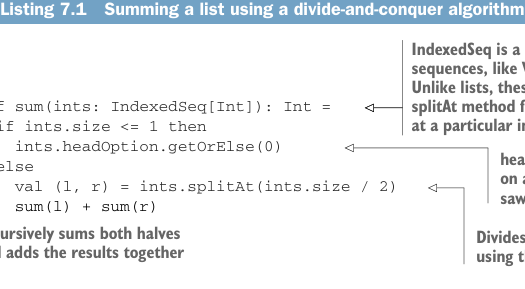

```yaml
---
title: "Страница 0174"
outline: false
---
```

# Страница 0174

[<- Страница 0173](./page-0173) | [Индекс страниц](./) | [Страница 0175 ->](./page-0175)

> Часть 2: Функциональный дизайн и библиотеки комбинаторов / Глава 7: Чисто функциональный параллелизм / 7.1 Выбор типов данных и функций

## 145 7.1 Выбор типов данных и функций

точно в таком виде? Давай отшлифуем эту хуйню до чего-то, что реально заимплементить, глянув на простую задачу, которую можно параллелить: суммирование списка интов. Обычный левый фолд для этого выглядел бы так:

```scala
def sum(ints: Seq[Int]): Int =
  ints.foldLeft(0)((a, b) => a + b)
```

Тут `Seq` — это такой папаша для листов и других последовательностей в стдлибе (standard library). Ключевой момент — у него есть метод `foldLeft`. Вместо последовательного фолда по кругу можно замутим divide-and-conquer («разделяй и властвуй», смотри листинг ниже).

**Листинг 7.1.** Суммирование списка через алгоритм «разделяй и властвуй»



> `IndexedSeq` — суперкласс для последовательностей с рандом-акцессом (random access), типа `Vector`, в стдлибе. В отличие от листов, у них `splitAt` работает эффективно, разбивая на две части по индексу.

```scala
def sum(ints: IndexedSeq[Int]): Int =
  if ints.size <= 1 then
    ints.headOption.getOrElse(0)
  else
    val (l, r) = ints.splitAt(ints.size / 2)
    sum(l) + sum(r)
```

> `headOption` — метод на всех коллекциях в Скале. Мы его видели в главе 4.
>
> - Разделяет последовательность пополам через `splitAt`
> - Рекурсивно суммирует обе половины и складывает результаты

Мы режем последовательность пополам через `splitAt`, рекурсивно суммируем обе половины, а потом комбайним результаты. И в отличие от варианта на `foldLeft`, этот можно параллелить — половины суммируем параллельно, без лишней хуйни.


**Важность простых примеров.** Суммирование интов на практике — такая фигня быстрая, что параллелизм только оверхед (overhead) навешает, больше потеряешь, чем выиграешь. Но именно такие тривиальные кейсы — как базовый squat перед пауэрлифтингом — идеальны для дизайна функциональной либы. Сложные примеры завалены случайными деталями и инцидентальными структурами, которые мозг забивают на старте. Мы хотим ухватить суть домена, а не тонуть в спецкейсах: начинаем с пустяков, выносим общие паттерны через все примеры, постепенно накручиваем сложность. В функциональном дизайне цель — выразительность не через горы if'ов и патчворк-кода, а через простые, композабельные (composable) базовые типы и функции, которые как лего собираются в любой шедевр.

Пока размышляем, какие типы данных и функции позволят запараллелить эту задачу, меняем угол атаки. Вместо того чтобы сразу нырять в имплементацию — ковырять руками API `java.lang.Thread` и либу `java.util.concurrent`, рискуя утонуть в их подкапотной херне, — дизайним свой идеальный API прямо по примерам. А потом оттуда спускаемся назад к реальности, как нормальные инженеры.

[<- Страница 0173](./page-0173) | [Индекс страниц](./) | [Страница 0175 ->](./page-0175)
