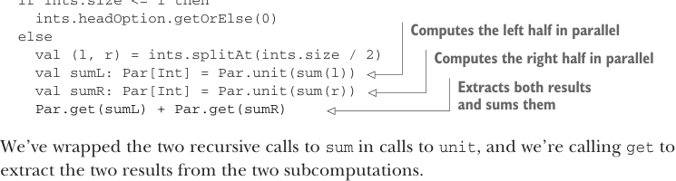
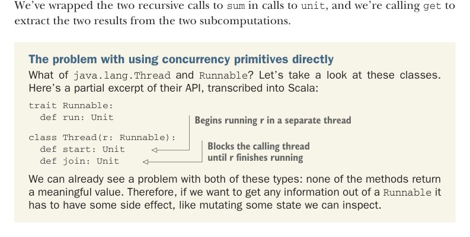

# Страница 0175

[<- Страница 0174](./page-0174) | [Оглавление страниц](./) | [Страница 0176 ->](./page-0176)

> Часть 2: Функциональный дизайн и библиотеки комбинаторов / Глава 7: Чисто функциональный параллелизм / 7.1 Выбор типов данных и функций / 7.1.1 Тип данных для параллельных вычислений

### 7.1.1 Тип данных для параллельных вычислений

Глянь на строчку `sum(l)` `+` `sum(r)`, где рекурсивно ебём `sum` по двум половинкам. Уже по одной этой херне видно, что любой тип для наших параллельных вычислений должен держать результат внутри, как пивасик в термосе после код-ревью. Этот результат будет с осмысленным типом (тут `Int`), и нам нужен способ его вытащить, чтоб не ковыряться в кишках. Короче, берём это озарение и лепим дизайн. Пока просто придумываем контейнер для результата — `Par[A]` (для *parallel*, бля), и узаконь существование нужных функций:

- `def unit[A](a:` `=>` `A): Par[A]` — Берёт ленивый `A` (by-name параметр), возвращает вычисление, которое может это проебать в отдельном треде. Назвали `unit`, потому что это как unit параллелизма — обёртка вокруг одного значения, чтоб запустить в свободный полёт, как дрон над офисом.

- `def get[A](a:` `Par[A]): Par[A] ⇒ A` — Вытаскивает итоговое значение из параллельного вычисления, чтоб не гадать на кофейной гуще.

А мы правда можем так заебенить? Конечно, хули нет! Пока не парься о других функциях, о том, как внутри `Par` нахуйено, или как это имплементировать — завтра разберёмся, как всегда. Мы просто вычитываем нужные типы и функции из примера, как код из стаковерфлоу копипастим, но с мозгами. Давай обновим этот пример.

**Листинг 7.2** Обновляем `sum` нашим кастомным типом данных

```scala
def sum(ints: IndexedSeq[Int]): Int =
  if ints.size <= 1 then
    ints.headOption.getOrElse(0)
  else
    val (l, r) = ints.splitAt(ints.size / 2)
    val sumL: Par[Int] = Par.unit(sum(l))
    val sumR: Par[Int] = Par.unit(sum(r))
    Par.get(sumL) + Par.get(sumR)
```



> Вычисляет левую половину параллельно  
> Вычисляет правую половину параллельно  
> Вытаскивает оба результата и суммирует их



Мы оборачиваем два рекурсивных вызова `sum` в `unit`, а потом дергаем `get`, чтоб вытащить результаты из двух подвычислений — классика, как парсинг JSON без библиотеки.

## Проблема с прямыми примитивами concurrency

А что с `java.lang.Thread` и `Runnable`? Давай глянем на этих ребят. Вот кусок их API, переписанный на Скалу, чтоб не путаться:

```scala
trait Runnable:
  def run: Unit
```

> Запускает `r` в отдельном треде

```scala
class Thread(r: Runnable):
  def start: Unit
  def join: Unit
```

> Блокирует вызывающий тред, пока `r` не отъебётся

Уже видно, какая подстава с этими типами: ни один метод не возвращает ничего путного. Так что, чтоб из `Runnable` хоть какую-то инфу вытащить, нужен сайд-эффект — мутируй стейт, читай из рефчика или пиши в лог, классический императивный цирк, где параллелизм как пьяный слон в посудной лавке.

[<- Страница 0174](./page-0174) | [Оглавление страниц](./) | [Страница 0176 ->](./page-0176)
