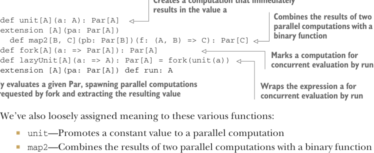

# Страница 0181
[<- Страница 0180](./page-0180) | [Индекс страниц](./) | [Страница 0182 ->](./page-0182)

> Часть 2: Функциональный дизайн и библиотеки комбинаторов / Глава 7: Чисто функциональный параллелизм / 7.2 Выбор представления

Мы так, на пальцах порассуждали о том, какая херня нужна на самом деле, чтоб заспавнить параллельную таску, и разобрали последствия, если значения `Par` будут в курсе этой кухни. А если `fork` просто держит свой неоценённый аргумент до поры до времени, то ему нахуй не нужен доступ к механизмам параллелизма; он берёт неоценённый `Par` и просто метит его на параллельную оценку (concurrent evaluation). Давай теперь примем это толкование для `fork`. С этой моделью сам `Par` не парится, как реализовывать параллелизм на деле. Это больше как дескриптор параллельного вычисления, который потом интерпретирует что-то вроде функции `get`. Это сдвиг от прошлого подхода, где `Par` был просто контейнером для значения, которое можно выковырять, когда созреет. Теперь это полноценная first-class программа, которую можно запустить. Так что переименуем нашу функцию `get` в `run` и скажем, что именно здесь параллелизм и воплощается в жизнь:

```scala
extension [A](pa: Par[A]) def run: A
```

Поскольку `Par` теперь чистая структура данных, без всяких побочек, `run` должен сам озаботиться реализацией параллелизма — спавнить новые треды, делегировать в пулу, или какую другую хуйню использовать.

### 7.2 Выбор представления

Просто покопавшись в этом примитивном примере и продумав, куда заведут разные выборы — типа, где подвох вылезет в проде, — мы набросали такой API.

**Листинг 7.4 Базовый набросок API для `Par`**


> Создаёт вычисление, которое сразу выдаёт значение `a`  
> Комбинирует результаты двух параллельных вычислений бинарной функцией



```scala
def unit[A](a: A): Par[A]

extension [A](pa: Par[A])
  def map2[B, C](pb: Par[B])(f: (A, B) => C): Par[C]

def fork[A](a: => Par[A]): Par[A]

def lazyUnit[A](a: => A): Par[A] = fork(unit(a))

extension [A](pa: Par[A])
  def run: A
```

> Метит вычисление на параллельную оценку (concurrent evaluation) при вызове `run`  
> Оборачивает выражение `a` для параллельной оценки (concurrent evaluation) при `run`  
> Полностью оценивает заданный `Par`, спавня параллельные вычисления по запросам от `fork` и выковыривая итоговое значение

Мы также в общих чертах навесили смысл на эти функции:

- `unit` — Поднимает константу в параллельное вычисление
- `map2` — Комбинирует результаты двух параллельных вычислений бинарной функцией
- `fork` — Метит вычисление на параллельную оценку (concurrent evaluation) — оценка не случится, пока не форсишь `run`
- `lazyUnit` — Оборачивает неоценённый аргумент в `Par` и метит на параллельную оценку (concurrent evaluation)
- `run` — Выковыривает значение из `Par`, выполняя вычисление

В любой момент, пока рисуешь API, можно начинать думать о возможных представлениях для абстрактных типов, которые там торчат.

[<- Страница 0180](./page-0180) | [Индекс страниц](./) | [Страница 0182 ->](./page-0182)
