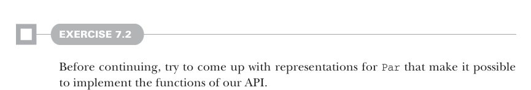

# Страница 0182
[<- Страница 0181](./page-0181) | [Индекс страниц](./) | [Страница 0183 ->](./page-0183)

> Часть 2: Функциональный дизайн и библиотеки комбинаторов / Глава 7: Чисто функциональный параллелизм / 7.2 Выбор представления

## 153 7.2 Выбор представления



#### УПРАЖНЕНИЕ 7.2

Прежде чем ломиться дальше, сам придумай представления для `Par`, чтоб все наши API-функции на нём завелись без косяков.  
Не подсматривай, как на настоящем код-ревью — почувствуй себя в шкуре того, кто вчера это всё сломал.

Давай разберёмся, сможем ли мы слепить нормальное представление. Мы в курсе, что `run` должен как-то запускать асинхронные таски — типа, делегировать работу в параллельный мир, чтоб не тормозить основной тред, как пробка на МКАДе в час пик. Могли бы сами наклепать низкоуровневый API (low-level API), но нафиг, если в стандартной библиотеке Java (StdLib) уже валяется готовый класс `java.util.concurrent.ExecutorService`? Вот его API, переписанный на Scala для наших FP-душ:

```scala
class ExecutorService:
def submit[A](a: Callable[A]): Future[A]
trait Callable[A]:
def call: A
```

> По сути, просто ленивый A, который материализуется когда-нибудь потом

```scala
trait Future[A]:
def get: A
def get(timeout: Long, unit: TimeUnit): A
def cancel(evenIfRunning: Boolean): Boolean
def isDone: Boolean
def isCancelled: Boolean
```

Короче, `ExecutorService` позволяет запихнуть туда `Callable` (в Scala мы бы просто ленивый аргумент в `submit` юзали, без этих Java-заморочек) и получить взамен `Future` (фьючерс) — хэндл на вычисление, которое потенциально уже крутится в отдельном треде, как демон в фоне. Чтоб выдернуть значение из `Future` (фьючерса), юзаем `get` — оно блочит текущий тред, пока не отдаст товар, и есть бонусы для отмены: кинет exception после таймаута или прочего геморроя. Давай прикинем, что наша `run` имеет под рукой `ExecutorService`, и посмотрим, что это подскажет про репрезентацию `Par`:

```scala
extension [A](pa: Par[A]) def run(s: ExecutorService): A
```

Самое примитивное представление для `Par[A]` — это `ExecutorService` `=>` `A`. Тогда `run` реализуется в одну строку, тривиально, как `42`. Но было бы заебись отложить решение — сколько ждать эту херню или рубить её нахуй — тому, кто зовёт `run`. Так что `Par[A]` превращается в `ExecutorService` `=>` `Future[A]` (фьючерс[A]), а `run` просто кидает обратно `Future`:


```scala
opaque type Par[A] = ExecutorService => Future[A]
extension [A](pa: Par[A]) def run(s: ExecutorService): Future[A] = pa(s)
```

> Par — это opaque type (непрозрачный тип), чтоб никто не лез в нутро, хотя могли и type alias (псевдоним типа) юзнуть, или case class (кейс-класс), как со State в прошлой главе. Opaque даёт инкапсуляцию без лишних аллокаций, чтоб GC (сборщик мусора) не бесился зря — мы все через это дерьмо проходили.

[<- Страница 0181](./page-0181) | [Индекс страниц](./) | [Страница 0183 ->](./page-0183)
