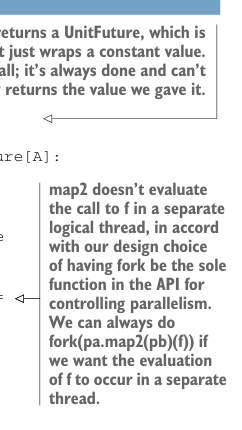

# Страница 0183

[<- Страница 0182](./page-0182) | [Индекс страниц](./) | [Страница 0184 ->](./page-0184)

> Часть 2: Функциональный дизайн и библиотеки комбинаторов / Глава 7: Чисто функциональный параллелизм / 7.2 Выбор представления / 7.2.1 Уточнение API

Заметили, что `Par` — это функция, которая жрёт `ExecutorService` на вход? Короче, `Future` реально материализуется только когда этот `ExecutorService` ей подкинешь. Неужели всё так просто, как в меме про "it works on my machine"? Давайте пока поверим на слово и если потом упрёмся в какую-то недостающую фичу — перелопатим модель, без паники.

### 7.2.1 Уточнение API

Способ, которым мы ковырялись до сих пор, — чистой воды искусство, как будто в вакууме кодим. На деле границы между дизайном API и выбором представления размыты, как кофе после ночного спринта, и одно не обязательно предшествует другому. Идеи по представлению подсказывают API, API диктует, как лучше закодить данные, и ты плавно переключаешься между этими видами, как в пинболе: вопросы — эксперименты — прототипы — и так по кругу. В этой секции покопаемся в нашем API поглубже. Мы уже выжали максимум из простого примера, но перед тем, как лепить новые примитивы, разберёмся, что можно наколдовать из тех, что уже есть. С нашими примитивами и их семантикой мы вырезали себе уютную песочницу-универсум. Теперь пора разведать, какие идеи в нём оживают. Это процесс текучий, как лава в вулкане: правила меняй когда угодно, перестрой представление с нуля или кинь новый примитив — и смотри, как твоё творение оживает. Начнём с имплементации тех API-функций, что уже накидал. Теперь, когда у нас есть представление для `Par`, первый набросок должен быть проще пареной репы. Дальше — простая реализация на том представлении `Par`, которое мы выбрали.

Листинг 7.5. Базовая реализация для `Par`



> `unit` — это функция, которая возвращает `UnitFuture`, простейшую обёртку над константным значением. Она вообще не трогает `ExecutorService`; всегда готова, отменить нельзя. Её `get` просто выдаёт то значение, что мы ей впихнули.

```scala
object Par:
def unit[A](a: A): Par[A] = es => UnitFuture(a)
private case class UnitFuture[A](get: A) extends Future[A]:
def isDone = true
def get(timeout: Long, units: TimeUnit) = get
def isCancelled = false
def cancel(evenIfRunning: Boolean): Boolean = false
```

> `map2` не запускает вызов `f` в отдельном логическом треде — по нашему дизайну `fork` единственный босс, кто рулит параллелизмом. Хотите `f` в отдельном треде? Делайте `fork(pa.map2(pb)(f))`, и порядок.

> Мы возвращаем функцию от `ExecutorService` к `Future[C]`. Типизация на `es` опциональна; Скатта её сам выведет из дефа `Par`.

```scala
extension [A](pa: Par[A])
def map2[B, C](pb: Par[B])(f: (A,B) => C): Par[C] =
(es: ExecutorService) =>
val futureA = a(es)
val futureB = b(es)
```

[<- Страница 0182](./page-0182) | [Индекс страниц](./) | [Страница 0184 ->](./page-0184)
