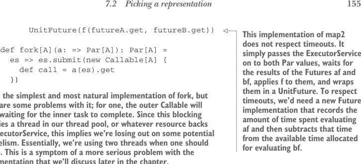

# Страница 0184
[<- Страница 0183](./page-0183) | [Индекс страниц](./) | [Страница 0185 ->](./page-0185)

> Часть 2: Функциональный дизайн и библиотеки комбинаторов /  
> Глава 7: Чисто функциональный параллелизм /  
> 7.2 Выбор представления /  
> 7.2.1 Уточнение API



## 155 7.2 Выбор представления

```scala
UnitFuture(f(futureA.get, futureB.get))
```

> Эта имплементация `map2` на таймауты плюёт с высокой колокольни — просто пихает  
> `ExecutorService` в оба `Par`, торчит как пробка в час пик, дожидаясь фьючеров  
> `af` и `bf`, лепит `f` и заворачивает всю херню в `UnitFuture`.  
> Чтобы таймауты работали по-человечески, нужен новый `Future`, который засечёт,  
> сколько времени `af` сожрал, и отнимет это дерьмо от запаса на `bf`.  
> Иначе — привет, дедлок вечный.


```scala
def fork[A](a: => Par[A]): Par[A] =
es => es.submit(new Callable[A] {
def call = a(es).get
})
```

> Это самая простецкая и естественная `fork`, но с ней полный пиздец под капотом:  
> внешний `Callable` будет тупить как осёл, дожидаясь, пока внутренний таск допилит.  
> Этот блокинг жрёт тред в пуле (или что там `ExecutorService` под собой держит),  
> и вуаля — параллелизм улетучивается нахрен. Два треда вместо одного — чистой воды  
> профит для JVM-админов. А это всего лишь симптом куда жирнее проблемы с  
> имплементацией, о которой я вам ещё расскажу в этой главе, пацаны, держитесь.

Заметим заодно, что `Future` — это не чисто функциональный интерфейс, блядь.  
Именно поэтому мы не пускаем юзеров наших либ к `Future` напрямую ковыряться.  
Но ключевое: хоть методы `Future` на сайд-эффектах как на стероидах, весь наш  
`Par` API остаётся чистым, как слеза девственницы. Только когда юзер зовёт `run`  
и имплементация ловит `ExecutorService`, мы вываливаем эту мясорубку с `Future`.  
Короче, юзеры кодят под чистый интерфейс, чья подкапотная начинка в итоге на  
эффектах построена. Но раз API чистый — эффекты эти не сайд-эффекты, а вполне  
себе контролируемые. В части 4 разберём эту хуйню по косточкам, поверьте, там  
будет мясо.


#### УПРАЖНЕНИЕ 7.3

*Сложное*: Почини имплементацию `map2` так, чтоб она уважала контракт  
таймаутов на `Future`. Не спи, братан, это не шутки.


#### УПРАЖНЕНИЕ 7.4

Этот API уже позволяет вытворять кучу фокусов. Вот простой примерок.  
Используя `lazyUnit`, напиши функцию, которая любую `A => B` перегонит в  
асинхронную версию — чтоб результат вычислялся лениво, в фоне, без вашего участия:

```scala
def asyncF[A, B](f: A => B): A => Par[B]
```

Что ещё можно слепить из этих комбинаторов? Давайте глянем на более  
приземлённый пример, чтоб не парило в облаках.

[<- Страница 0183](./page-0183) | [Индекс страниц](./) | [Страница 0185 ->](./page-0185)
