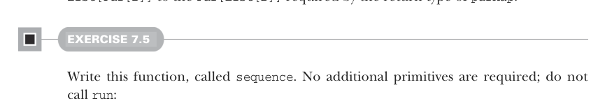

# Страница 0186
[<- Страница 0185](./page-0185) | [Индекс страниц](./) | [Страница 0187 ->](./page-0187)

> Часть 2: Функциональный дизайн и библиотеки комбинаторов / Глава 7: Чисто функциональный параллелизм / 7.2 Выбор представления / 7.2.1 Доработка API

## 157 7.2 Выбор представления

Теперь давай покопаемся, какие операции можно наколдовать из нашего текущего API и как эти хрени между собой переплетены, как нити в паутине. Понимание, какие комбинаторы реально базовые, а не просто понты для резюме, пригодится в третьей части, где мы будем абстрагировать общие паттерны по библиотекам — типа, как в том меме с "DRY или умри".<sup>5</sup>

Давай глянем, насколько далеко заберёмся, реализуя `parMap` через существующие комбинаторы:

```scala
def parMap[A, B](ps: List[A])(f: A => B): Par[List[B]] =
val fbs: List[Par[B]] = ps.map(asyncF(f))
...
```

Помнишь, `asyncF` берёт `A => B` и форкает параллельный поток, чтоб выдать `A => Par[B]` — чисто как кролик плодится. Так что *N* параллельных форков — раз плюнуть, но как собрать этот урожай результатов? Застряли, как в московской пробке на МКАДе? А типы, суки, не обманешь — они орут, что нужен способ превратить `List[Par[B]]` в `Par[List[B]]`, который требует возвращаемый тип `parMap`. Я сам через это проходил в проде, когда параллелизм на Scala в battle-tested коде впихивал.



#### УПРАЖНЕНИЕ 7.5

Слепите эту функцию под ником `sequence`. Без новых примитивов, и не смейте трогать `run` — работайте с тем, что есть, как в реальной жизни на дедлайне:

```scala
def sequence[A](ps: List[Par[A]]): Par[List[A]]
```

Как только `sequence` в кармане, допилим нашу имплементацию `parMap`:

```scala
def parMap[A, B](ps: List[A])(f: A => B): Par[List[B]] =
fork:
val fbs: List[Par[B]] = ps.map(asyncF(f))
sequence(fbs)
```

Обратите внимание, мы обмотали всю хрень в `fork` — чисто ленивый кот, который не шевелится заранее. С такой реализацией `parMap` свалит мгновенно, даже на огромном списке, как будто "не сегодня". А когда потом дернем `run`, она форкнет один асинхронный поток, который сам родит *N* параллельных ублюдков, дождётся их финиша и соберёт в список — типа матрёшка с параллелизмом. Если б пропустили `fork`, то `parMap` сначала бы слепила `fbs` список на вызывающем треде, прежде чем `sequence` — и привет, блокировка, как в старые добрые imperative времена.

<sup>5</sup> В этом случае есть ещё одна причина не лепить `parMap` как новый примитив: пиздец как сложно сделать правильно, особенно если таймауты уважать хочется. Базовые комбинаторы часто прячут хитрую логику под капотом, и переиспользуя их, не дублируем этот геморрой — классика FP, пацаны.

[<- Страница 0185](./page-0185) | [Индекс страниц](./) | [Страница 0187 ->](./page-0187)
