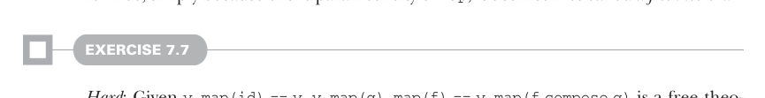
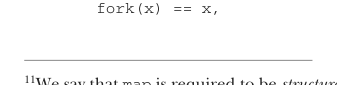

# Страница 0189
[<- Страница 0188](./page-0188) | [Индекс страниц](./) | [Страница 0190 ->](./page-0190)

> Часть 2: Функциональный дизайн и библиотеки комбинаторов / Глава 7: Чисто функциональный параллелизм / 7.3 Алгебра API / 7.3.2 Закон форкинга


```scala
unit(x).map(f)  == unit(f(x))
unit(x).map(id) == unit(id(x))
unit(x).map(id) == unit(x)
y.map(id)       == y
```

> Исходный закон
>
> Подставляем функцию-идентичность вместо `f`.


> Упрощаем. Подставляем `y` вместо `unit(x)` с обеих сторон.

Блядь, заебись! Наш новый, упрощённый закон болтает только о `map` — выходит, болтовня про `unit` была чистой воды лишней хуйнёй, как ненужный лог в продакшене. Чтобы врубиться, о чём этот новый закон вещает, давай подумаем, чего `map` *не* может делать. Например, он не может кинуть exception и обосраться до того, как применит функцию к результату (видишь, почему это нарушает закон?). Всё, что ему по силам — это применить функцию `f` к результату `y`, и разумеется, когда эта функция — чистая `id`, то `y` остаётся нетронутым, как монада в вакууме. Ещё интереснее: имея `y.map(id)` `==` `y`, мы можем подставить в обратную сторону и вернуться к исходному, более заковыристому закону. (Попробуй сам!) Логически это возможно, потому что `map` не может себя по-разному вести для разных типов функций — parametricity, сука, как строгий типизатор, держит всё в узде. Следовательно, при `y.map(id)` `==` `y` верно, что `unit(x).map(f)` `==` `unit(f(x))`. Поскольку эта вторая теорема достаётся нам задаром чисто из-за параметричности `map`, её иногда зовут *бесплатной теоремой*.¹²



#### УПРАЖНЕНИЕ 7.7

*Сложное*: Дано `y.map(id)` `==` `y`, `y.map(g).map(f)` `==` `y.map(f compose g)` — это бесплатная теорема. (Это иногда называют *map fusion* (слияние map), и её можно юзать для оптимизации; вместо того чтобы спавнить отдельный параллельный компт для второго маппинга, мы можем слить его в первый.)¹³ Докажешь?

### 7.3.2 Закон форкинга

Как ни заебись всё это, но этот закон особо не жмёт нашу имплементацию в тиски. Ты наверняка и так предполагал эти свойства, даже не парившись (странно было бы лепить спецкейсы в `map`, `unit` или `ExecutorService.submit`, или чтобы `map` рандомно кидал эксепшены, как пьяный интерн). Давай возьмём покруче свойство — `fork` не должен ебать мозги результату параллельного компта:



```scala
fork(x) == x,
```

¹¹Мы говорим, что `map` должен быть *сохраняющим структуру* — он не меняет структуру параллельного компта, только значение внутри.  
¹²Идея бесплатных теорем пришла от Philip Wadler в его классической статье “Theorems for Free!” (http://mng.bz/Z9f1).  
¹³Наша репрезентация `Par` не даёт нам шанса имплементировать эту оптимизацию, потому что это непрозрачная функция. Например, `y.map(g)` возвращает новый `Par` — чёрный ящик, короче. Когда мы потом зовём `.map(f)` на этом результате, мы потеряли знание о том, из каких частей слеплен `y.map(g)`: а именно, `y`, `map` и `g`. Всё, что видим — непрозрачная функция, и выковырять `g`, чтобы скомпозить с `f`, не выходит. Если бы `Par` был материализован как дата-тип (ну, типа, enum (перечисление) с операциями), то мы могли бы паттерн-матчить и выискивать места для этой хуйни. Сам поэкспериментируй, если охота.

[<- Страница 0188](./page-0188) | [Индекс страниц](./) | [Страница 0190 ->](./page-0190)
