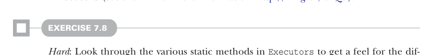

# Страница 0190

[<- Страница 0189](./page-0189) | [Индекс страниц](./) | [Страница 0191 ->](./page-0191)

> Часть 2: Функциональный дизайн и библиотеки комбинаторов /  
> Глава 7: Чисто функциональный параллелизм /  
> 7.3 Алгебра API /  
> 7.3.3 Нарушение закона: тонкий баг

## 161 7.3 Алгебра API

Это кажется хуёвой очевидностью для нашей имплементации, и свойство заебись желанное — оно ровно то, чего мы ждём от `fork`. `fork(x)` должен делать ту же хуйню, что и `x`, только асинхронно — в отдельном логическом треде, подальше от мейн-потока. Если этот закон не держится всегда, то нам придётся как-то угадывать, когда можно вызывать без смены смысла, без всякой подмоги от системы типов. Удивительно, но эта простая херня жёстко сковывает нашу имплементацию `fork`. Записал такой закон — скидывай шляпу имплементера, надевай дебаггерскую, как на ночном код-ревью после трёх банок энергетика, и пытайся его разъебать. Продумай все углы, выдумывай контрпримеры, собери неформальное доказательство — чтоб скептичный коллега, который сам через это говно прошёл, поверил и не стал спорить в пул-реквесте.

### 7.3.3 Нарушение закона: тонкий баг

Давай применим этот подход мышления на практике. Ожидаем, что `fork(x) == x` для любого `x` и любого `ExecutorService` (исполнителя служб). Мы в теме, что `x` может быть — это какое-то выражение на `fork`, `unit`, `map2` (и других комбинаторах от них). А с `ExecutorService` что? Какие имплементации возможны? В классе `java.util.concurrent.Executors` куча статических методов с разными вариантами (загляни в документацию API за деталями: http://mng.bz/urQd). Это как меню в шаурмечке — на любой вкус и под любой deadlock.

#### УПРАЖНЕНИЕ 7.8

*Сложное*: Пройдись по статическим методам в `Executors`, чтоб прочувствовать разные имплементации `ExecutorService` (ExecutorService). Потом, не читая дальше, вернись к своей имплементации `fork` и либо найди контрпример, либо убеди себя, что закон держится. Не торопись, как я когда-то на проде — лучше десять минут подумать, чем час фиксить.

## Зачем законы о коде и доказательства важны

Может показаться, что заявлять и доказывать свойства API — это какая-то академическая хуйня, не из нашей реальности. В обычном программировании такого не делают, и точка. А в FP зачем эта засада?

В функциональном программировании — сплошной кайф выносить общую логику в обобщённые (generic) переиспользуемые (reusable) компоненты, которые компонуются как конструктор Лего. Побочные эффекты (side effects) ебут композиционность в жопу, но шире — любые скрытые предположения или поведение вне канала (off-band behavior), которое не даёт относиться к компонентам (функциям или чему угодно) как к *чёрным ящикам* (black boxes), превращают композицию в минное поле.

В нашем примере с законом для `fork` видно: если он не держится, то наши универсальные комбинаторы вроде `parMap` станут unsafe — в зависимости от контекста параллельного вычисления могут выдать deadlock, и привет, прод висит на миллисекунду, которая растянется на часы.

Алгебра API с осмысленными законами, которые помогают рассуждать, делает интерфейс удобным для клиентов, а объекты — настоящими чёрными ящиками. Как увидим в третьей части, это ключ к тому, чтоб выносить общие паттерны через все наши библиотеки, без боли и страданий.

[<- Страница 0189](./page-0189) | [Индекс страниц](./) | [Страница 0191 ->](./page-0191)
