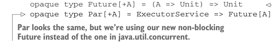

# Страница 0192
[<- Страница 0191](./page-0191) | [Индекс страниц](./) | [Страница 0193 ->](./page-0193)

> Часть 2: Функциональный дизайн и библиотеки комбинаторов /  
> Глава 7: Чисто функциональный параллелизм /  
> 7.3 Алгебра API /  
> 7.3.4 Полная неблокирующая реализация Par на акторах

## 163 7.3 Алгебра API

Это, блядь, точно избавляет от дедлока — как ножницы от узлов Гордона.  
Но единственная засада в том, что мы на деле не форкаем отдельный логический тред для вычисления `fa`.  
Так что `fork(hugeComputation)(es)` для какого-нибудь `ExecutorService` `es` прогоняет `hugeComputation` прямиком в главном треде — и это ровно та хуйня, от которой мы и звали `fork`, чтоб избежать.  

Хотя комбинатор полезный, пацаны, — позволяет лениво отложить рождение вычисления до момента, когда оно реально влезет в дело.  
Назовём его `delay`:

```scala
def delay[A](fa: => Par[A]): Par[A] =
es => fa(es)
```

Но нам бы охота запускать произвольные вычисления на пулах тредов фиксированного размера, как нормальные пацаны в продакшене.  
Для этого придётся перевыбрать представление `Par` — старое уже не катит, как ржавый байк на трассе.

### 7.3.4 Полная неблокирующая реализация Par на акторах

В этом разделе напилим полную неблокирующую имплементацию `Par`, которая рулится на пулах фиксированного размера.  
Это не сердцевина наших разборов по функциональному дизайну, так что если не тянет — прыгай сразу на следующий раздел, я не обижусь.  
Иначе вникай.  

Суть проблемы текущего представления: из `Future` значение не выковыряешь без блока текущего треда на `get` — чистый resource leak (утечка ресурсов), как дырявое ведро в океане.  
Представление `Par` без такой хуйни должно быть *неблокирующим*: имплементы `fork` и `map2` ни хуя не должны звать методы вроде `Future.get`, которые вешают текущий тред, как висельника.  

Написать это правильно — та ещё акробатика на канате без сетки.  
К счастью, у нас законы под рукой для тестов, и хватит сделать *один раз* как надо.  
Дальше юзеры либы кайфуют от компонуемого абстрактного API, которое всегда выдаёт правильную херню без подвохов.  

В коде ниже не парься разбирать каждую закорючку — просто глянь, как на реальном примере выглядит корректное представление `Par`, которое законы уважает, как старших на код-ревью.

**ОСНОВНАЯ ИДЕЯ**  
Как напилить неблокирующее представление `Par`?  
Идея проще пареной репы.  
Вместо того чтоб превращать `Par` в `java.util.concurrent.Future`, откуда значение тянем с блоком (типа, сиди и жди мамку), введём свой `Future`, куда зарегаем колбэк — и он сам отстреляется, когда результат дозреет.  
Лёгкий сдвиг фокуса, как с синхронного колбека на промисы (promises) в JS, только без той JS-шной анархии:




```scala
opaque type Future[+A] = (A => Unit) => Unit
opaque type Par[+A] = ExecutorService => Future[A]
```

> Функция, которая жрёт функцию типа `A => Unit` и возвращает `Unit`.  
> `Par` выглядит так же, но мы юзаем наш свежий неблокирующий `Future` вместо того говна из `java.util.concurrent`.

Наш тип `Par` выглядит в точности так же, только теперь впихнули нашу версию `Future` с другим API, чем в `java.util.concurrent`.  
Вместо того чтоб дёргать `get` за результатом из `Future`, наш `Future` — непрозрачный тип, который инкапсулирует

[<- Страница 0191](./page-0191) | [Индекс страниц](./) | [Страница 0193 ->](./page-0193)
