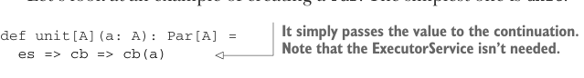
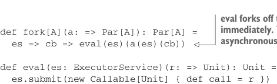

# Страница 0194
[<- Страница 0193](./page-0193) | [Индекс страниц](./) | [Страница 0195 ->](./page-0195)

> Часть 2: Функциональный дизайн и библиотеки комбинаторов / Глава 7: Чисто функциональный параллелизм / 7.3 Алгебра API / 7.3.4 Полностью неблокирующая реализация Par на акторах

## 165 7.3 Алгебра API

не хотим торчать как лохи и ждать результат. Мы могли бы даже дойти до полной жести — выкинуть `run` нахуй из API и вместо этого выставить метод `apply` прямо на `Par`, чтоб юзеры вешали асинхронные колбэки. Это был бы вполне годный дизайн, без базара, но пока оставим API как есть, не будем ебаться.

Давайте глянем, как пилим `Par`. Самый простой — это `unit`, как два пальца:



> Просто пихает значение в continuation. ExecutorService (ExecutorService) тут на хуй не нужен, чисто для галочки.

```scala
def unit[A](a: A): Par[A] =
  es => cb => cb(a)
```

Раз `unit` уже имеет значение типа `A` под рукой, ему остаётся только вызвать continuation `cb` и скормить ему это значение. Если этот continuation из нашей имплементации `run`, то latch отвалится, и результат вылезет мгновенно, без соплей.

А что с `fork`? Вот тут мы и впиливаем реальный параллелизм, как в мясорубку:



> eval отфарковывает вычисление a и сваливает сразу. Колбэк сработает асинхронно на другом треде, без блокировок.

```scala
def fork[A](a: => Par[A]): Par[A] =
  es => cb => eval(es)(a(es)(cb))
```


> Хелпер, чтоб асинхронно вычислить экшн на каком-нибудь ExecutorService (ExecutorService), классика жанра.

```scala
def eval(es: ExecutorService)(r: => Unit): Unit =
  es.submit(new Callable[Unit] {
    def call = r
  })
```

Когда `Future` (Future), который возвращает `fork`, ловит свой continuation `cb`, он отфарковывает таску на вычисление by-name аргумента `a`. Как только аргумент досчитается и родит `Future[A]`, мы регистрируем `cb`, чтоб она сработала, когда этот `Future` выдаст свой финальный `A`.

А с `map2` что? Вспомним сигнатуру:

```scala
extension [A](pa: Par[A])
  def map2[B, C](pb: Par[B])(f: (A, B) => C): Par[C]
```

Тут неблокирующая имплементация — это уже пиздец какой квест, с race conditions на каждом шагу. По идее, `map2` должна запустить оба аргумента `Par` параллельно, как два гопника в драке. Когда оба результата прилетят, вызываем `f` и пихаем итоговый `C` в continuation. Но race conditions тут как тараканы — лезут отовсюду, и на чистых примитивах `java.util.concurrent` без акробатики не обойтись.

## КРАТКО ОБ АКТОРАХ

Чтоб заимплементить `map2`, возьмём неблокирующий примитивище под названием *актор* (*actor*). Актор — это по сути конкурентный процесс (concurrent process), который не жрёт тред постоянно, как алкаш пиво. Он занимает тред только когда сообщение прилетает. Круто то, что хоть сто тредов шлют ему спам параллельно, актор жрёт по одному сообщению за раз, остальное в очередь — и никаких race conditions или дедлоков, как в дешёвом мультике.

[<- Страница 0193](./page-0193) | [Индекс страниц](./) | [Страница 0195 ->](./page-0195)
