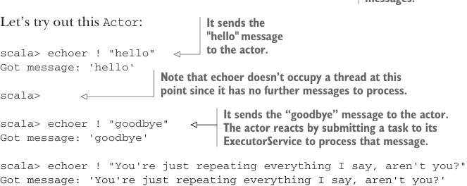
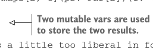

# Страница 0195

[<- Страница 0194](./page-0194) | [Индекс страниц](./) | [Страница 0196 ->](./page-0196)

> Часть 2: Функциональный дизайн и библиотеки комбинаторов / Глава 7: Чисто функциональный параллелизм / 7.3 Алгебра API / 7.3.4 Полностью неблокирующая реализация Par на акторах

Лучше всего это на живом примере показать, пацаны. Много реализаций акторов нам подойдёт заебись, включая ту, что в популярной Akka (загляни в https://github.com/akka/akka), но чтоб не ебаться с зависимостями, возьмём нашу минималистичную хуйню из Actor.scala в коде главы — простая как валенок:


> Актор юзает ExecutorService (ExecutorService), чтоб обрабатывать сообщения по приходу, так что здесь мы его и создаём.

```scala
scala> import fpinscala.parallelism.*
scala> val s = Executors.newFixedThreadPool(4)
s: java.util.concurrent.ExecutorService = ...
```

> Это простейший актор, который просто эхоит строковые сообщения. Обратите внимание, мы пихаем ему `s` — ExecutorService (ExecutorService) для обработки сообщений.

```scala
scala> val echoer = Actor[String](s):
|
msg => println(s"Got message: '$msg'")
echoer: fpinscala.parallelism.Actor[String] = ...
```



Давай потестируем этого `Actor`, как на код-ревью:

> Отправляет сообщение "hello" актору.

```scala
scala> echoer ! "hello"
Got message: 'hello'
```

> Обратите внимание, `echoer` на этом этапе не жрёт тред, потому что больше сообщений нет — классика, когда всё тихо, как в могиле.

```scala
scala>
```

> Отправляет “goodbye” актору. Тот в ответ кидает таску в свой ExecutorService (ExecutorService) на обработку.

```scala
scala> echoer ! "goodbye"
Got message: 'goodbye'
scala> echoer ! "You're just repeating everything I say, aren't you?"
Got message: 'You're just repeating everything I say, aren't you?'
```

Понимание деталей имплементации `Actor` вообще не обязательно — это как разбирать, почему в твоём старом тачке иногда троит на холостых. Правильная и эффективная реализация — штука хитрая, с подвохами, но если жопа чешется, загляни в Actor.scala из кода главы. Там меньше сотни строк обычного скалярного кода.<sup>15</sup>

## ИМПЛЕМЕНТАЦИЯ MAP2 ЧЕРЕЗ АКТОРОВ

Теперь можем заимплементить `map2` через `Actor`, который соберёт результаты с обоих аргументов. Код прямолинейный, race conditions (race conditions, состояния гонки) хуй там плавал — мы ж знаем, что `Actor` обрабатывает ровно одно сообщение за раз, как строгий бармен в очереди.

**Листинг 7.7. Имплементация `map2` с `Actor`**

```scala
extension [A](p: Par[A]) def map2[B, C](p2: Par[B])(f: (A, B) => C): Par[C] =
es => cb =>
var ar: Option[A] = None
var br: Option[B] = None
// this implementation is a little too liberal in forking of threads -
// it forks a new logical thread for the actor and for stack-safety,
// forks evaluation of the callback `cb`
```



> Используются две mutable var (mutable var, изменяемые переменные) для хранения двух результатов — да, mutable, но в этом контексте как нож в руках хирурга, а не долбоёба.

<sup>15</sup>Главная засада в имплементации актора — это когда несколько тредов одновременно ему пишут. Нужно гарантировать, что сообщения обрабатываются по одному, и все они в итоге дойдут, а не зависнут в очереди до греков. Но даже так код выходит коротким, как мем про "works on my machine".

[<- Страница 0194](./page-0194) | [Индекс страниц](./) | [Страница 0196 ->](./page-0196)
