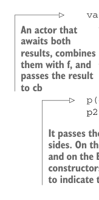
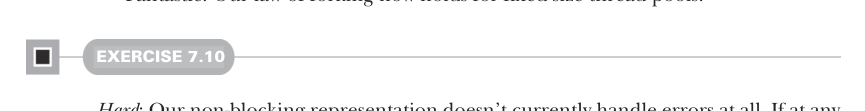

# Страница 0196
[<- Страница 0195](./page-0195) | [Индекс страниц](./) | [Страница 0197 ->](./page-0197)

> Часть 2: Функциональный дизайн и библиотеки комбинаторов / Глава 7: Чисто функциональный параллелизм / 7.3 Алгебра API / 7.3.4 Полностью неблокирующая реализация Par на акторах

## 167 7.3 Алгебра API



```scala
val combiner = Actor[Either[A,B]](es):
case Left(a) =>
if br.isDefined then eval(es)(cb(f(a, br.get)))
else ar = Some(a)
case Right(b) =>
if ar.isDefined then eval(es)(cb(f(ar.get, b)))
else br = Some(b)
p(es)(a => combiner ! Left(a))
p2(es)(b => combiner ! Right(b))
```

> Если результат A прилетел первым, актор запихнёт его в ar и будет дожидаться B, как верный пёс. А если A припёрся последним, и B уже ждёт в br, то сразу вызовет f на обоих и скормит получившийся C в колбэк cb.

> Актор, который ждёт оба результата, склеивает их через f и пихает результат в cb

> Аналогично, если B заявился первым, он сохраняется в br, и ждём A. Если B последним, а A уже на месте — бах, f на пару, и C в cb.

> Актор передаёт себя как continuation обеим сторонам. Слева (A) оборачивает результат в Left, справа (B) — в Right. Это конструкторы Either, чтоб актор понял, откуда прилетело.

С такими реализациями мы теперь можем гонять `Par` любой сложности, не парившись о нехватке тредов, даже если акторам доступен только один JVM-тред — классика, как в том меме про "один тред на всю JVM, держи сто потоки". Давай проверим в REPL:

```scala
scala> import java.util.concurrent.Executors, fpinscala
➥ .parallelism.Nonblocking.Par
scala> val p = Par.parMap(List.range(1, 100000))(math.sqrt(_))
p: fpinscala.parallelism.Nonblocking.Par[List[Double]] = < function >
scala> val x = p.run(Executors.newFixedThreadPool(2))
x: List[Double] = List(1.0, 1.4142135623730951, 1.7320508075688772,
2.0, 2.23606797749979, 2.449489742783178, 2.6457513110645907, 2.828
4271247461903, 3.0, 3.1622776601683795, 3.3166247903554, 3.46410...
```

Это вызовет `fork` аж 100k раз, запустит 100k акторов и будет склеивать результаты по двое. Благодаря нашей неблокирующей `Actor`, не нужно 100k JVM-тредов — мы не идиоты. Круто, блядь. Закон форкинга теперь держится даже на фиксированном пуле тредов.



#### УПРАЖНЕНИЕ 7.10

*Сложное*: Наша неблокирующая хуйня пока вообще не ловит ошибки. Если где-то в вычислениях вылетит exception, `run` в реализации `latch` никогда не досчитает до нуля, и exception просто проглотится, как вчерашний борщ. Почини это дерьмо?

Отойдём на шаг назад: цель этой секции не в том, чтоб слепить идеальную неблокирующую `fork` — я через такое говно прошёл не раз, и знаю, где собака зарыта. Главное — показать, что законы рулят. Они дают свежий угол для дизайна

[<- Страница 0195](./page-0195) | [Индекс страниц](./) | [Страница 0197 ->](./page-0197)
