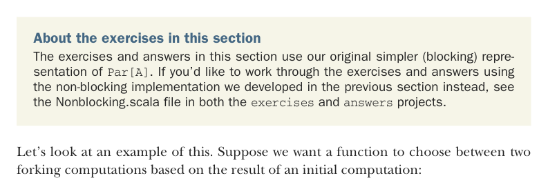

# Страница 0197
[<- Страница 0196](./page-0196) | [Индекс страниц](./) | [Страница 0198 ->](./page-0198)

> Часть 2: Функциональный дизайн и библиотеки комбинаторов / Глава 7: Чисто функциональный параллелизм / 7.4 Доведение комбинаторов до их самой общей формы

библиотеку. Если б не сели и не вывели на бумажке парочку законов нашего API, этот ебучий thread leak (утечка потоков) в первой имплементации всплыл бы хуй знает когда — через полгода в продакшене, когда уже всё на коленях. Короче, подходов к выбору законов для API несколько, выбирай на вкус. Можно взять концептуальную модель, порассуждать оттуда и постулировать, что должно работать всегда. Можно нагенерировать полезные или поучительные законы чисто на коленке (как мы с законом `fork`) и проверить, реально ли их пропихнуть в модель без пиздеца. Ну и наконец, глянуть на свою реализацию и выдумать законы под неё — но это, блядь, слабовато.[^16]

### 7.4 Доведение комбинаторов до их самой общей формы

Функциональный дизайн — это итеративный процесс, как вечный код-ревью в аду. Написал API, слепил хотя бы прототип — садись и гоняй его по всё более заковыристым и реалистичным сценариям; иногда поймёшь, что без новых комбинаторов никуда. Перед тем как нырять в код с головой, прикинь, нельзя ли довести нужный комбинатор до универсальной формы, как нож швейцарский. Может, тебе просто частный кейс какого-то монстра-комбинатора и нужен, а не самодельный велосипед.



Насчёт упражнений в этом разделе. Упражнения и ответы тут на нашей оригинальной простой (блокирующей) репрезентации `Par[A]`. Хочешь порешать на неблокирующей имплементации из прошлого раздела — валяй, `Nonblocking.scala` лежит в проектах `exercises` (упражнения) и `answers` (ответы).

Давай разберём примерок. Допустим, хотим функцию, которая на основе результата начального вычисления выбирает между двумя форкнутыми компьютациями:

```scala
def choice[A](cond: Par[Boolean])(t: Par[A], f: Par[A]): Par[A]
```

Это конструирует вычисление, которое прёт по `t`, если `cond` выдало `true`, или по `f`, если `cond` дало `false`. Конечно, можно заблокироваться на результате `cond`, а потом по нему решить, жарить `t` или `f`. Вот простая блокирующая имплементация:[^17]

```scala
def choice[A](cond: Par[Boolean])(t: Par[A], f: Par[A]): Par[A] =
es =>
if cond.run(es).get then t(es)
else f(es)
```

> Заметь, мы блочимся на результате `cond`.

[<- Страница 0196](./page-0196) | [Индекс страниц](./) | [Страница 0198 ->](./page-0198)

[^16]: Этот последний способ генерить законы — самый хуёвый, потому что легко подогнать их под имплементацию, даже если она багавая или висит на куче странных сайд-условий, от которых композиция летит нахуй.

[^17]: Смотри `Nonblocking.scala` в коде главы для неблокирующей версии.
