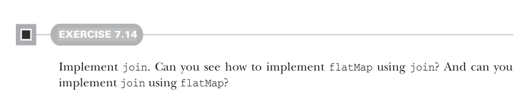

# Страница 0200

[<- Страница 0199](./page-0199) | [Индекс страниц](./) | [Страница 0201 ->](./page-0201)

> Часть 2: Функциональный дизайн и библиотеки комбинаторов / Глава 7: Чисто функциональный параллелизм / 7.5 Заключение

## 171 7.5 Заключение

#### УПРАЖНЕНИЕ 7.14

Затопи `join`. Видишь, как `flatMap` на `join` слепить? А `join` на `flatMap`?

На этом тормозим, но рой эту алгебру дальше, пацаны. Замути посложнее примеры, откопай новые комбинаторы и посмотри, что вылезет! Вот парочка вопросов, чтоб мозги зашевелились:

- Сможешь `map2` с той же сигнатурой замутить, но на `flat-` `Map` и `unit`? Чем смысл отличается от классического `map2`?
- Какие законы между `join` и остальными примитивами этой алгебры проскакивают?
- Есть параллельные вычисления, которые эта алгебра не тянет? А такие, что даже с новыми примитивами не вырамешь?

Распознавание выразительности и лимитов алгебры Чем больше ты в FP ковыряешься, тем круче навык вырабатывается: чуять, какие функции из алгебры вырастают, а где она на нуле тупит. Взять тот пример выше — поначалу неочевидно же, что `choice` чисто на `map`, `map2` и `unit` не слепить, и что `choice` — это просто спецкейс `flatMap`. Со временем такие инсайты как по маслу пойдут, и ты научишься алгебру тюнить, чтоб нужный комбинатор влез. Это везде в API-дизайне выстрелит, поверь, я сам через это говно прошёл.

На практике — свести API к минимальным примитивам это как золотая жила. Как мы раньше `parMap` на существующих комбинаторах слепили, помнишь? Примитивы часто хитрую логику жрут, и переиспользовать их — значит не дублировать этот геморрой.

### 7.5 Заключение

Мы допилили библиотеку для параллельных и асинхронных вычислений чисто функционально. Домен сам по себе заебись, но главная фишка главы — заглянуть в процесс функционального дизайна, понять типичные подставы и как их разруливать. В главах 4–6 был акцент на разделении concerns, конкретно — отделить описание вычисления от интерпретатора, который его гоняет. Тут мы это в деле увидели на примере библиотеки, которая

[<- Страница 0199](./page-0199) | [Индекс страниц](./) | [Страница 0201 ->](./page-0201)
