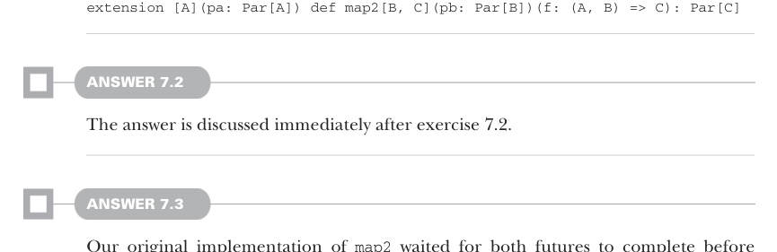
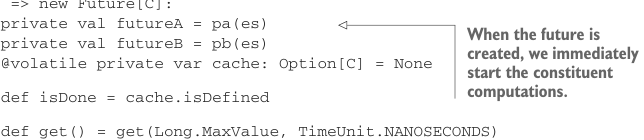
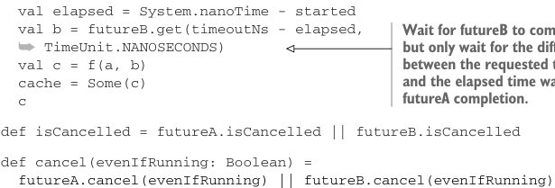

# Страница 0202

[<- Страница 0201](./page-0201) | [Индекс страниц](./) | [Страница 0203 ->](./page-0203)

> Часть 2: Функциональный дизайн и библиотеки комбинаторов / Глава 7: Чисто функциональный параллелизм / 7.6 Ответы на упражнения

## 173 7.6 Ответы на упражнения

Альтернативно, можно определить `map2` как extension-метод прямо на `Par[A]`:



```scala
extension [A](pa: Par[A]) def map2[B, C](pb: Par[B])(f: (A, B) => C): Par[C]
```

#### ОТВЕТ 7.2

Ответ разбирается сразу после упражнения 7.2.

#### ОТВЕТ 7.3

В нашей изначальной имплементации `map2` мы тупо ждали, пока оба фьючерса не допилятся, и только потом кидали `UnitFuture` с финальным результатом. К тому моменту, как коллер вообще увидит `Future`, все подзадачи уже давно отработали! Вместо `UnitFuture`, нам надо запустить подвычисления на раз-два и сразу выкинуть композитный `Future`, который на них ссылается — как пацанов на параллельную стройку отправить и сразу план проекта вернуть. Коллер потом сам разберётся: через оверлоад `get` с таймаутом или другие методы на `Future`. А для таймаутной версии `get` вызываем её на каждом из запущенных фьючерсов. Ждём первый результат с заданным таймаутом, меряем, сколько реально ушло времени, и потом второй — с уменьшенным таймаутом на эту разницу:

```scala
extension [A](pa: Par[A])
def map2Timeouts[B, C](pb: Par[B])(f: (A, B) => C): Par[C] =
es => new Future[C]:
private val futureA = pa(es)
private val futureB = pb(es)
@volatile private var cache: Option[C] = None
```



> Когда фьючерс создаётся, мы сразу запускаем подвычисления — без лишнего дрочья.

```scala
def isDone = cache.isDefined
```


```scala
def get() = get(Long.MaxValue, TimeUnit.NANOSECONDS)
```

> Ждём futureA, но если не уложится в таймаут — на хуй.

```scala
def get(timeout: Long, units: TimeUnit) =
val timeoutNs = TimeUnit.NANOSECONDS.convert(timeout, units)
val started = System.nanoTime
val a = futureA.get(timeoutNs, TimeUnit.NANOSECONDS)
val elapsed = System.nanoTime - started
val b = futureB.get(timeoutNs - elapsed,
➥ TimeUnit.NANOSECONDS)
val c = f(a, b)
cache = Some(c)
c
```



> Ждём futureB, но только остаток от исходного таймаута минус то, что просидели на futureA.

```scala
def isCancelled = futureA.isCancelled || futureB.isCancelled
def cancel(evenIfRunning: Boolean) =
futureA.cancel(evenIfRunning) || futureB.cancel(evenIfRunning)
```

[<- Страница 0201](./page-0201) | [Индекс страниц](./) | [Страница 0203 ->](./page-0203)
