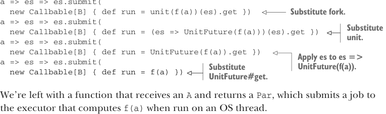

# Страница 0203

[<- Страница 0202](./page-0202) |  
[Индекс страниц](./) |  
[Страница 0204 ->](./page-0204)

> Часть 2: Функциональный дизайн и библиотеки комбинаторов / Глава 7: Чисто функциональный параллелизм / 7.6 Ответы на упражнения


#### ОТВЕТ 7.4

Мы возвращаем анонимную функцию, которая, как только жрёт значение типа `A`, сразу же валит вызов `lazyUnit`, пихнув туда `f(a)`:

```scala
def asyncF[A, B](f: A => B): A => Par[B] =
  a => lazyUnit(f(a))
```

Поскольку `lazyUnit` жрёт by-name параметр, `f(a)` ещё даже не шевельнулся — лениво лежит, как и положено. Чтобы въехать, почему `lazyUnit(f(a))` роняет именно ту фичу, что нам нужна, давай пошагово подставим дефы, как на код-ревью у пацанов:

```scala
a => lazyUnit(f(a))
a => fork(unit(f(a)))
a => es => es.submit(
  new Callbable[B] {
    def run = unit(f(a))(es).get
  }
)
a => es => es.submit(
  new Callbable[B] {
    def run = (es => UnitFuture(f(a)))(es).get
  }
)
a => es => es.submit(
  new Callbable[B] {
    def run = UnitFuture(f(a)).get
  }
)
a => es => es.submit(
```

> Подставляем `lazyUnit`.



> Подставляем `fork`.

> Подставляем `unit`.

> Применяем `es` к `es => UnitFuture(f(a))`. Подставляем `UnitFuture#get`.

```scala
new Callbable[B] {
  def run = f(a)
})
```

В итоге остаётся голая функция, которая берёт `A` и выдаёт `Par` — та кидает джоб в экзекьютор, и когда этот джоб рванёт на ОС-треде (OS-thread), он честно посчитает `f(a)`. Классика, без подвохов.


#### ОТВЕТ 7.5

`sequence` мы уже не раз ковыряли — это ж типичный `foldRight` на базе `map2`, копипастим, подтипаем чутка и вперёд:

```scala
def sequence[A](pas: List[Par[A]]): Par[List[A]] =
  pas.foldRight(unit(List.empty[A]))((pa, acc) => pa.map2(acc)(_ :: _))
```

Но можно и получше провернуть, как в `sums` — технику ту же самую. Разделим компьютацию на две половины, каждую параллельно запустим. Поскольку нужен быстрый рандом-акцесс к элементам коллекции (а не линейный треш), сначала версию на `IndexedSeq[Par[A]]` напишем:

```scala
def sequenceBalanced[A](pas: IndexedSeq[Par[A]]): Par[IndexedSeq[A]] =
  if pas.isEmpty then
    unit(IndexedSeq.empty)
  else if pas.size == 1 then
    pas.head.map(a => IndexedSeq(a))
  else
    val (l, r) = pas.splitAt(pas.size / 2)
    sequenceBalanced(l).map2(sequenceBalanced(r))(_ ++ _)
```

[<- Страница 0202](./page-0202) |  
[Индекс страниц](./) |  
[Страница 0204 ->](./page-0204)
