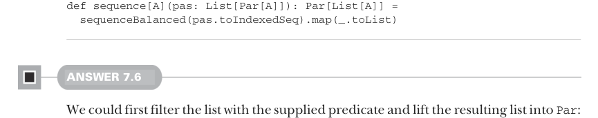
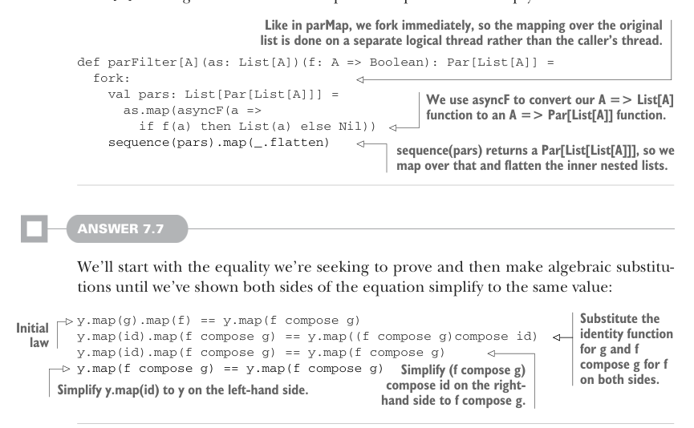

# Страница 0204

[<- Страница 0203](./page-0203)  
[Оглавление страниц](./)  
[Страница 0205 ->](./page-0205)

> Часть 2: Функциональный дизайн и библиотеки комбинаторов / Глава 7: Чисто функциональный параллелизм / 7.6 Ответы на упражнения

## 175 7.6 Ответы на упражнения

Короче, тогда реализуем `sequence` на базе `sequenceBalanced`, проще пареной репы:



```scala
def sequence[A](pas: List[Par[A]]): Par[List[A]] =
  sequenceBalanced(pas.toIndexedSeq).map(_.toList)
```

#### ОТВЕТ 7.6

Можем сперва профильтровать список по предикату и запихнуть результат в `Par`:

```scala
def parFilter[A](as: List[A])(f: A => Boolean): Par[List[A]] =
  unit(as.filter(f))
```

Но тут параллелизма — кот наплакал, полный пиздец. Попробуем пофиксить, заменив `unit` на `lazyUnit`:

```scala
def parFilter[A](as: List[A])(f: A => Boolean): Par[List[A]] =
  lazyUnit(as.filter(f))
```

Чуток получше — фильтрация на отдельном логическом треде, но вся херня фильтруется на одном и том же треде, как стадо баранов в загоне. Нам-то реально нужно, чтоб каждый вызов предиката на своём треде отрывался, чтоб толпа разбрелась. Как в `parMap`, юзаем `asyncF`, но вместо прямой `f` кидаем анонимку, которая из `A` лепит `List[A]` — список с одним элементом, если предикат пропустил, или пустышку в жопу иначе:



> Как в parMap, форкаем сразу нахуй, так что маппинг по оригиналу на отдельном логическом треде крутится, а не на треде того, кто вызвал, чтоб не тормозить основного.

```scala
def parFilter[A](as: List[A])(f: A => Boolean): Par[List[A]] =
  fork:
    val pars: List[Par[List[A]]] =
      as.map(asyncF(a =>
        if f(a) then List(a)
        else Nil
      ))
    sequence(pars).map(_.flatten)
```

> asyncF юзаем, чтоб нашу A => List[A] перекрутить в A => Par[List[A]], как мясорубка фарш.
>
> sequence(pars) выдаёт Par[List[List[A]]], так что маппим по этому и флетчим вложенные списки, чтоб не было этой матрёшки.

#### ОТВЕТ 7.7

Начнём с равенства, которое доказываем, и будем алгебраически подставлять, пока обе стороны не сольются в один красивый член:

> Подставляем id вместо g и (f compose g) вместо f с обеих сторон. Справа (f compose g) compose id упрощаем до f compose g. Слева y.map(id) сводим к y, как дважды два.

```scala
y.map(g).map(f)           == y.map(f compose g)
y.map(id).map(f compose g) == y.map((f compose g)compose id)
y.map(id).map(f compose g) == y.map(f compose g)
y.map(f compose g)        == y.map(f compose g)
```

> Исходный закон

[<- Страница 0203](./page-0203)  
[Оглавление страниц](./)  
[Страница 0205 ->](./page-0205)
