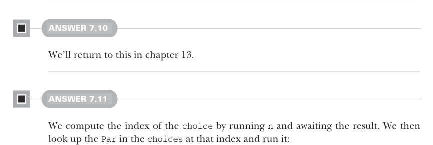

# Страница 0205

[<- Страница 0204](./page-0204)  
[Индекс страниц](./)  
[Страница 0206 ->](./page-0206)

> Часть 2: Функциональный дизайн и библиотеки комбинаторов /  
> Глава 7: Чисто функциональный параллелизм /  
> 7.6 Ответы на упражнения


#### ОТВЕТ 7.8

Представь, как оно ебётся с фиксированным пулом тредов (thread pool),  
где всего один тред — чистый одиночный забег, без всякого параллелизма.  
Разберём это в деталях в следующей секции, не переживай.


#### ОТВЕТ 7.9

Любой фиксированный пул тредов можно задеадлокить (deadlock) классической подставой:  
запускать выражение вида `fork(fork(fork(x)))`, где `fork` на один больше,  
чем тредов в пуле. Каждый тред в пуле тупо блочится на вызове `.get`,  
все зависают намертво, а один лишний логический тред ждёт своей очереди,  
чтоб всех раздеадлокить. Классика, через которую каждый FP-шник проходил в продакшене.



#### ОТВЕТ 7.10

Вернемся к этому в главе 13, не торопись.

#### ОТВЕТ 7.11

Вычисляем индекс для `choice`, запуская `n` и ожидая результат.  
Потом лезем в `choices` по этому индексу, хватаем `Par` и валим её в полёт:

```scala
def choiceN[A](n: Par[Int])(choices: List[Par[A]]): Par[A] =
es =>
val index = n.run(es).get % choices.size
choices(index).run(es)
```

Реализация `choice` через `choiceN` — это хак с переводом условника  
в индекс через `map`. Мы выбрали для случая `true` индекс `0`,  
а для `false` — `1`, чтоб не путаться:

```scala
def choice[A](cond: Par[Boolean])(t: Par[A], f: Par[A]): Par[A] =
choiceN(cond.map(b => if b then 0 else 1))(List(t, f))
```

[<- Страница 0204](./page-0204)  
[Индекс страниц](./)  
[Страница 0206 ->](./page-0206)
