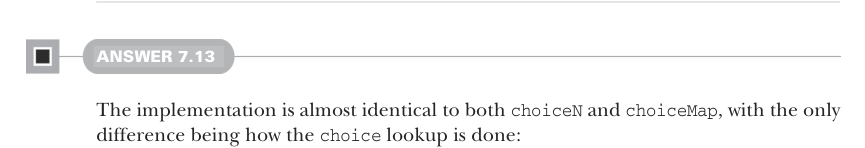
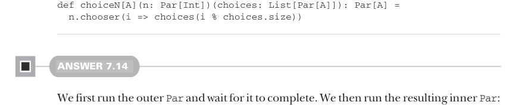

# Страница 0206

[<- Страница 0205](./page-0205) | [Указатель страниц](./) | [Страница 0207 ->](./page-0207)

> Часть 2: Функциональный дизайн и библиотеки комбинаторов / Глава 7: Чисто функциональный параллелизм / 7.6 Ответы на упражнения

## 177 Ответы на упражнения 7.6


#### ОТВЕТ 7.12

Реализация ``choiceMap`` — это почти клон ``choiceN``, только вместо того, чтоб рыться по индексу в ``List`` за ``Par``, мы шастаем по ключу в ``Map``, как цивилизованные люди, а не как в старом добром массиве-говне:

```scala
def choiceMap[K, V](key: Par[K])(choices: Map[K, Par[V]]): Par[V] =
es =>
val k = key.run(es).get
choices(k).run
```

Хочешь — тормози тут и сам наколдуй новый, более общий комбинатор, на котором ``choice``, ``choiceN`` и ``choiceMap`` будут плясать, как матрешки в FP-цирке.



#### ОТВЕТ 7.13

Реализация почти один в один с ``choiceN`` и ``choiceMap``, разница только в том, как мы роемся в ``choice``:

```scala
extension [A](pa: Par[A]) def chooser[B](choices: A => Par[B]): Par[B] =
es =>
val a = pa.run(es).get
choices(a).run
```

Теперь ``choice`` можно слепить через ``chooser``, сунув функцию, которая хватает ``t``, если ``cond`` отдает ``true``, а иначе — ``f``:

```scala
def choice[A](cond: Par[Boolean])(t: Par[A], f: Par[A]): Par[A] =
cond.chooser(b => if b then t else f)
```

Точно так же ``choiceN`` лепим, сунув функцию, которая шарится по списку ``choices``.



```scala
def choiceN[A](n: Par[Int])(choices: List[Par[A]]): Par[A] =
n.chooser(i => choices(i % choices.size))
```

#### ОТВЕТ 7.14

Сначала пускаем в полет внешний ``Par`` и ждем, пока он не шлепнется, а потом уже разворачиваем внутренний ``Par``, как матрешку из матрешки:

```scala
def join[A](ppa: Par[Par[A]]): Par[A] =
es => ppa.run(es).get.run(es)
```

[<- Страница 0205](./page-0205) | [Указатель страниц](./) | [Страница 0207 ->](./page-0207)
