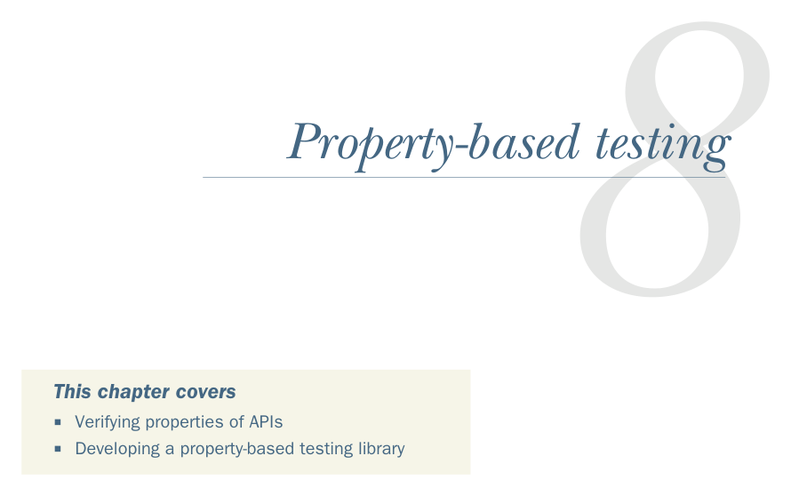

# Страница 0208
[<- Страница 0207](./page-0207) | [Индекс страниц](./) | [Страница 0209 ->](./page-0209)

> Часть 2: Функциональный дизайн и библиотеки комбинаторов / Глава 8: Тестирование на основе свойств

*Тестирование на основе свойств (property-based testing)*

### Эта глава охватывает

- Проверку свойств API (API)
- Разработку библиотеки для тестирования на основе свойств

В главе 7 мы еблись с дизайном функциональной либы для параллельных вычислений — той самой, где Par как супергерой, жонглирующий задачами асинхронно. 

Там мы вбили гвоздь: API должен быть алгеброй, блядь, настоящей — пачка типов данных, функции над ними и, главное, законы или свойства, которые связывают эти функции в единую картину, чтоб не было как в императивном (imperative) кошмаре, где всё на доверии. 

Намекнули заодно, что эти законы можно чекать автоматом, без ручного ковыряния в дебаггере, как лузер. 

Эта глава тащит нас прямиком к простой, но пиздец какой мощной либе для *тестирования на основе свойств*. 

Идея в том, чтоб отцепить спецификацию поведения проги от генерации тестовых кейсов — чистый FP-вайб, расцепление (decoupling) как в хорошем разводе. 

Ты, как senior, фокусируешься на "поведение должно быть таким-то" и кидаешь высокоуроневые ограничения (high-level constraints) на данные; фреймворк сам штампует тесты под эти рамки, запускает и бьёт по башке, если прога накосячила. 

Ладно, либа для тестов — не про параллельки, но сюрприз: комбинаторы у них как сиамские близнецы, неожиданно похожи (unexpectedly similar), и это не баг, а фича. 

В части 3 вернёмся к этому твисту, обещаю, сам через такое прошёл, знаю подвохи.

**179**

[<- Страница 0207](./page-0207) | [Индекс страниц](./) | [Страница 0209 ->](./page-0209)
