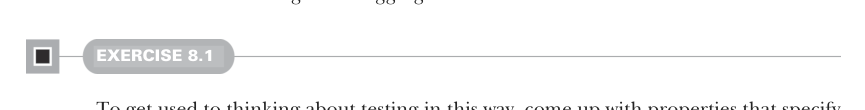
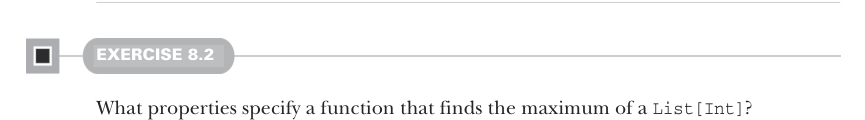

# Страница 0210

[<- Страница 0209](./page-0209) | [Указатель страниц](./) | [Страница 0211 ->](./page-0211)

> Часть 2: Функциональный дизайн и библиотеки комбинаторов / Глава 8: Тестирование на основе свойств / 8.1 Краткий тур по тестированию на основе свойств

## 181 8.1 Краткий тур по тестированию на основе свойств

**Генераторы и свойства**


```scala
forAll(intList)(ns => ns.reverse.reverse == ns)
Gen.listOf(Gen.choose(0, 100))
intList
List(54, 24, 18, …, 99)
List()
List(1)
List(2, 61, 14, 84, 12)
List(5, 5, 5)
List(99, 98, 97, …, 3, 2, 1)
ns => ns.reverse.reverse == ns
```

> Объект `Gen` генерит кучу разных объектов, чтоб запихнуть их в булево выражение и найти тот, который его наебнёт — сделает `false`.

**Рисунок 8.1: Генераторы и свойства**

Это предикаты (predicates). Свойства, само собой, могут наебнуться; вывод `failingProp.check` показывает, что предикат отвалился на каком-то инпуте — и этот инпут ещё и выведен, чтоб было проще ковыряться дальше в тестах или дебеже.



#### УПРАЖНЕНИЕ 8.1

Чтоб втянуться в этот подход к тестам — как в кроличью нору, где ScalaCheck сам себе генерит случаи из жопы, — прикинь свойства, которые специфицируют реализацию функции `sum: List[Int] => Int`. Не обязательно пилить исполняемый ScalaCheck-код — заебись и неформальное описание. Вот идеи, чтоб разогнаться:

- Разворот списка и сумма — должно дать тот же результат, что сумма оригинального, неразвёрнутого списка.
- Какая сумма выйдет, если все элементы списка — одно и то же значение?
- Ещё свойства в голову лезут?



#### УПРАЖНЕНИЕ 8.2

Какие свойства специфицируют функцию, которая находит максимум в `List[Int]`?

[<- Страница 0209](./page-0209) | [Указатель страниц](./) | [Страница 0211 ->](./page-0211)
