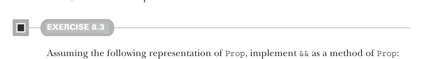

# Страница 0213
[<- Страница 0212](./page-0212) | [Индекс страниц](./) | [Страница 0214 ->](./page-0214)

> Часть 2: Функциональный дизайн и библиотеки комбинаторов / Глава 8: Тестирование на основе свойств / 8.1 Краткий тур по тестированию на основе свойств / 8.1.3 Смысл и API свойств

Тут мы просто на коленке слепили новый тип `Prop` (сокращение от *property*, как в ScalaCheck), чтоб обозначить результат, когда `Gen` прицепишь к предикату. Внутренности `Prop` нам пока похуй — не знаем, как он устроен внутри и какие ещё функции там болтаются, но из примера ясно, что `&&` у него есть, так что давай его подключим:

```scala
trait Prop:
def &&(that: Prop): Prop
```

### 8.1.3 Смысл и API свойств

Теперь, когда у нас есть пара осколков API, давай разберёмся, что мы хотим, чтоб наши типы и функции значили на деле. Сначала про `Prop`. Мы знаем, что есть `forAll` (чтоб свойство слепить), `&&` (чтоб свойства комбинировать) и `check` (чтоб свойство прогнать). В ScalaCheck этот `check` ещё и в консольку срет побочками. Для удобства можно такое выставить наружу, но на композицию это не годится. Например, `&&` для `Prop` не реализуешь, если его суть — просто `check`:3

```scala
trait Prop:
def check: Unit
def &&(that: Prop): Prop = ???
```

Поскольку `check` с побочками, единственный способ `&&` слепить — прогнать `check` на обоих `Prop`-ах. Если `check` тест-репорт в консоль льёт, то выльет дважды, и фейлы/пассы будут независимо друг от друга. Это хуйня полная, не то что надо. Проблема не столько в побочках `check`, сколько в том, что он инфу выкидывает в помойку. Чтоб `Prop`-ы комбинировать через `&&` и прочие, `check` (или что там свойства гоняет) должен что-то осмысленное возвращать. Какой тип? Давай подумаем, какую инфу мы хотим из проверки свойств выжимать. Минимум — прошёл тест или накрылся, чтоб `&&` заработал.



#### УПРАЖНЕНИЕ 8.3

Предполагая такое представление `Prop`, реализуй `&&` как метод `Prop`:

```scala
trait Prop:
def check: Boolean
```

3 Это может напомнить тебе о похожих заморочках из главы 7, когда мы ковырялись с `Thread` и `Runnable` для параллелизма.

[<- Страница 0212](./page-0212) | [Индекс страниц](./) | [Страница 0214 ->](./page-0214)
