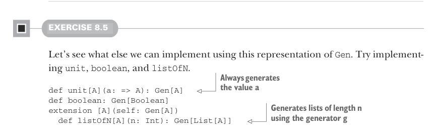

# Страница 0215
[<- Страница 0214](./page-0214) | [Индекс страниц](./) | [Страница 0216 ->](./page-0216)

> Часть 2: Функциональный дизайн и библиотеки комбинаторов / Глава 8: Тестирование на свойствах / 8.1 Краткий обзор тестирования на свойствах / 8.1.4 Смысл и API генераторов

Без понятия, как внутри `Gen` всё порисовано, хуй поймёшь, хватит ли тут инфы, чтоб генерить значения типа `A` (а это нам как раз нужно, чтоб заимплементить `check`). Так что пока переключаемся на `Gen` — разберёмся, что это за херня такая и от чего она зависит.

### 8.1.4 Смысл и API генераторов

Раньше мы определили, что `Gen[A]` — это штука, которая умеет генерить значения типа `A`. А как именно? Ну, рандомно, блядь, как в лотерее на код-ревью. Вспомни пример из шестой главы: там был интерфейс для чисто функционального генератора рандома `RNG` (RNG — random number generator), и мы показали, как удобно комбинировать вычисления, которые им пользуются. Можем просто завернуть `Gen` в `State`-трансформацию над рандом-генератором:⁵


```scala
opaque type Gen[+A] = State[RNG, A]
```

#### УПРАЖНЕНИЕ 8.4

Заимплементите `Gen.choose`, используя это представление для `Gen`. Оно должно генерить целые числа в диапазоне от `start` до `stopExclusive`. Смело юзайте функции, которые уже написали:

```scala
def choose(start: Int, stopExclusive: Int): Gen[Int]
```



#### УПРАЖНЕНИЕ 8.5

Давай глянем, что ещё можно наворотить с этим представлением `Gen`. Попробуйте заимплементить `unit`, `boolean` и `listOfN`.

> Всегда генерирует значение `a`

```scala
def unit[A](a: => A): Gen[A]

def boolean: Gen[Boolean]

extension [A](self: Gen[A])
  def listOfN[A](n: Int): Gen[List[A]]
```

> Генерирует списки длины `n`, используя генератор `g`

Как мы базарили в седьмой главе, нам интересно понять, какие операции — примитивы, а какие — деривативы, и слепить маленький, но пиздец какой выразительный набор примитивов. Крутой способ покопаться в том, что можно выразить с данным набором, — взять конкретные примеры, которые хочешь осилить, и проверить, слепится ли нужная функциональность. Пока копаешься, ищи паттерны, выноси их в комбинаторы, шлифуй примитивы. Мы настоятельно советуем остановиться тут и поиграться с примитивами и комбинаторами, что уже есть. Хотите идей для вдохновения? Вот парочка:

⁵ Вспомните это определение: `opaque type State[S, +A] = S => (A, S)`.

[<- Страница 0214](./page-0214) | [Индекс страниц](./) | [Страница 0216 ->](./page-0216)
