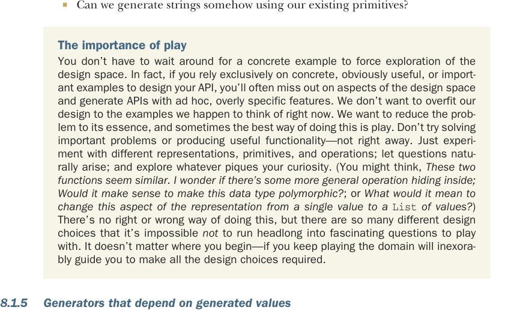

# Страница 0216

[<- Страница 0215](./page-0215) | [Индекс страниц](./) | [Страница 0217 ->](./page-0217)

> Часть 2: Функциональный дизайн и библиотеки комбинаторов / Глава 8: Тестирование на основе свойств / 8.1 Краткий тур по тестированию на основе свойств / 8.1.5 Генераторы, зависящие от сгенерированных значений

## 187 8.1 Краткий тур по тестированию на основе свойств (property-based testing)

- Если мы можем нагенерить один `Int` в каком-то диапазоне, то хули нам новый примитив для пары `(Int, Int)` в том же диапазоне?
- Можем ли мы слепить `Gen[Option[A]]` из `Gen[A]`? А `Gen[A]` из `Gen[Option[A]]`?
- Можем ли как-то генерить строки, используя наши текущие примитивы?



**Важность ебли с игрушками**  
Ты не сиди пузом кверху, жди конкретного примера, чтоб нырнуть в пространство дизайна — это хуйня полная. Наоборот, если дизайн API лепишь только по конкретным, очевидным или "суперполезным" примерам, то часто просрешь целые куски пространства и выдашь API с *ad hoc*-замыливаниями, заточенными под сиюминутную хуйню. Не хотим переобучать дизайн под те примеры, что сейчас в черепушке крутятся, как мемы из 2010-го. Хотим проблему до эссенции доварить, а лучший способ иногда — просто поиграться, как пацан с Lego в продакшене. Не лезь сразу в важные проблемы или полезные фичи — хуйня это. Бери разные репрезентации, примитивы, операции, верти их в руках; пусть вопросы сами вылазят, как баги в CI; копай то, что зацепит любопытство (типа: *Эти две функции похожи, блядь. А нет ли там общей операции, которая прячется, как squeeze в монаде? Смысл делать этот дата-тип полиморфным, или хуйня? Или что если эту хрень в репрезентации с одного значения перекинуть на `List` значений?*). Правильного пути нет, неправильного тоже — выборов дохуя, так что неминуемо влетишь в заебись вопросы для дальнейшей ебли. Стартуй откуда угодно — домен сам, как гравитация в FP, подтащит ко всем нужным дизайн-выборам, если не соскочишь.

### 8.1.5 Генераторы, зависящие от сгенерированных значений

Допустим, хотим `Gen[(String, String)]`, где вторая строка жрёт только символы из первой — чистая зависимость, как цепной рефлекс. Или есть `Gen[Int]`, который выбирает инт от 0 до 11, а нам под него `Gen[List[Double]]` нужной длины. Везде одна хуйня: генерим значение, а потом по нему решаем, какой генератор дальше юзать. Для такой акробатики нужен `flatMap` — он позволяет одному генератору сесть на шею другому и диктовать правила.


#### УПРАЖНЕНИЕ 8.6

Реализуй `flatMap`, а потом на его базе сделай эту более динамичную версию `listOfN`. Запихни `flatMap` и `listOfN` в класс `Gen`:

```scala
extension [A](self: Gen[A])
  def flatMap[B](f: A => Gen[B]): Gen[B]

extension [A](self: Gen[A])
  def listOfN(size: Gen[Int]): Gen[List[A]]
```

[<- Страница 0215](./page-0215) | [Индекс страниц](./) | [Страница 0217 ->](./page-0217)
