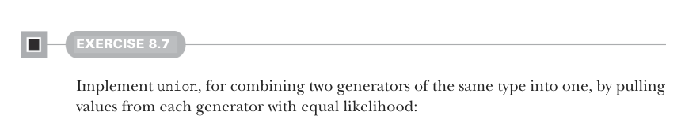
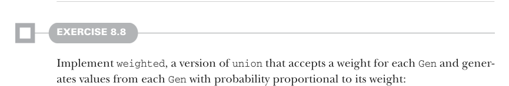

# Страница 0217
[<- Страница 0216](./page-0216) | [Индекс страниц](./) | [Страница 0218 ->](./page-0218)

> Часть 2: Функциональный дизайн и библиотеки комбинаторов / Глава 8: Property-based testing / 8.1 Краткий тур по property-based testing / 8.1.6 Доработка типа данных Prop



#### УПРАЖНЕНИЕ 8.7

Забабахай `union` — это чтоб два генератора одного типа слить в один, жмякая значения из каждого с равной долей удачи, как в рулетке 50/50:

```scala
def union[A](g1: Gen[A], g2: Gen[A]): Gen[A]
```



#### УПРАЖНЕНИЕ 8.8

Затопи `weighted` — версию `union`, которая жрёт веса для каждого `Gen` и генерит значения из каждого `Gen` с вероятностью пропорционально этому весу, типа лотерея с жирными шансами:

```scala
def weighted[A](g1: (Gen[A], Double), g2: (Gen[A], Double)): Gen[A]
```

### 8.1.6 Доработка типа данных Prop

Теперь, когда мы разобрались с генераторами как следует — как с этими хитрыми фабриками рандома, — давай вернёмся к определению `Prop`. 
Наша реализация `Gen` вывалила кучу инсайтов про то, что нужно `Prop` на самом деле, и текущее определение `Prop` висит вот так, как старая заплатка на штанах:

```scala
trait Prop:
def check: Either[(FailedCase, SuccessCount), SuccessCount]
```

`Prop` — это по сути ленивый[^6] `Either`, но ему не хватает мясца. 
У нас есть счётчик успешных тестов в `SuccessCount`, но мы не задали, сколько вообще кейсов надо прогнать, чтоб сказать «пропсас, всё ок». 
Можно конечно хардкодом заебать, но это как велосипед с квадратными колёсами — лучше абстрагировать эту хуйню:

```scala
opaque type TestCases = Int
object TestCases:
extension (x: TestCases) def toInt: Int = x
def fromInt(x: Int): TestCases = x
opaque type Prop = TestCases =>
Either[(FailedCase, SuccessCount), SuccessCount]
```

К тому же, мы логируем число успешных тестов с обеих сторон этого `Either`. 
А когда пропс проходит, подразумевается, что пасснутых тестов ровно столько, сколько мы передали в `check`, так что звоночек `check` ничего новенького не узнаёт, просто повторяя как попугай.

[^6]: Это в смысле, что мы могли бы заменить `trait` на thunk (ленивую функцию), который возвращает `Either`.

[<- Страница 0216](./page-0216) | [Индекс страниц](./) | [Страница 0218 ->](./page-0218)
