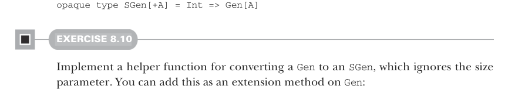
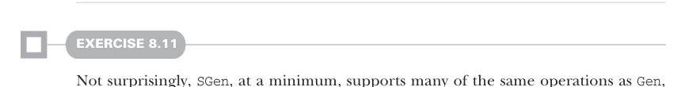
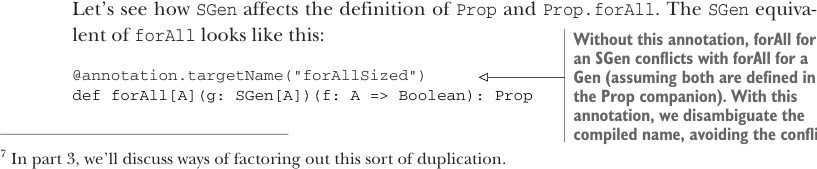

# Страница 0220
[<- Страница 0219](./page-0219) | [Индекс страниц](./) | [Страница 0221 ->](./page-0221)

> Часть 2: Функциональный дизайн и библиотеки комбинаторов /  
> Глава 8: Тестирование на основе свойств /  
> 8.2 Минимизация тестовых случаев

## 191 8.2 Минимизация тестовых случаев

Кстати, ScalaCheck рубит с первого подхода: *shrinking* (сжатие).  
Ничего криминального в нём нет (тот же трюк юзает Haskell'овская QuickCheck из free library, на которой ScalaCheck и висит: http://mng.bz/E24n),  
но ща разберёмся, что мы можем выжать из *sized generation* (генерации с размером).  
Это попроще будет и модульнее в каком-то роде — генераторы наши только должны знать,  
как слепить тест-кейс заданного размера, им похер на график обхода пространства тестов,  
а тестовая функция сама решает, по какому расписанию рыскать.  
Скоро увидим, как это в проде отыграет, без подвохов.  

Вместо того чтобы ковырять наш `Gen`, под который мы уже накатали пачку годных комбинаторов,  
давай введём *sized generation* как отдельный слой в либе.  
Простая репрезентация *sized*-генератора — это функция, которая жрёт размер и сплёвывает генератор:



```scala
opaque type SGen[+A] = Int => Gen[A]
```

#### УПРАЖНЕНИЕ 8.10

Сделай хелпер, который конвертит `Gen` в `SGen`, игнорируя размер — чисто как заглушка.  
Закинь это extension-методом на `Gen`:

```scala
extension [A](self: Gen[A]) def unsized: SGen[A]
```



#### УПРАЖНЕНИЕ 8.11

Не удивительно, что `SGen` хотя бы тянет те же операции, что и `Gen`,  
а имплементы там механические, как копипаст из шаблона.  
Определи *convenience*-функции (удобные функции) на `SGen`,  
которые просто делегируют в аналоги на `Gen`.<sup>7</sup>


#### УПРАЖНЕНИЕ 8.12

Слепите комбинатор `list` без явного размера.  
Он должен отдавать `SGen` вместо `Gen`.  
Имплементация генерит списки ровно нужного размера, без сюрпризов:

```scala
extension [A](self: Gen[A]) def list: SGen[List[A]]
```



Давай глянем, как `SGen` переворачивает определения `Prop` и `Prop.forAll`.  
Эквивалент `SGen` для `forAll` выглядит вот так:

> Без этой аннотации `forAll` для `SGen` конфликтует с `forAll` для `Gen`  
> (если оба в компаньоне `Prop`). С аннотацией мы разрешаем конфликт  
> в скомпиленном имени, избегая драки.

```scala
@annotation.targetName("forAllSized")
def forAll[A](g: SGen[A])(f: A => Boolean): Prop
```

<sup>7</sup> В части 3 разберём, как вынести такую дублировку, чтоб не бесило на код-ревью.

[<- Страница 0219](./page-0219) | [Индекс страниц](./) | [Страница 0221 ->](./page-0221)
