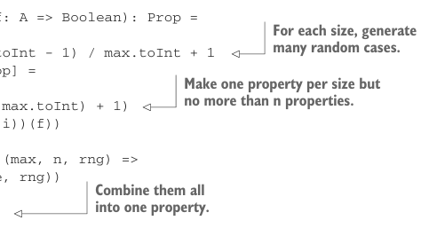
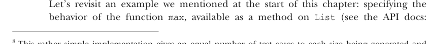

# Страница 0221
[<- Страница 0220](./page-0220) | [Индекс страниц](./) | [Страница 0222 ->](./page-0222)

> Часть 2: Функциональный дизайн и библиотеки комбинаторов / Глава 8: Тестирование на основе свойств / 8.2 Минимизация тестовых случаев / 8.2.2 Простенькие примеры

Видишь ли ты, почему эту функцию хуй встанешь и реализуешь? `SGen` требует размер на вход, а `Prop` получает ноль инфы про размер — полный пиздец, как будто зовёшь на код-ревью без ТЗ. Точно так же, как мы впихнули источник рандома и число тестов, просто добавляем размер как зависимость в `Prop`. Но раз `Prop` должна рулить вызовом базовых генераторов с разными размерами — типа босса, который раздаёт задачи, — то пусть `Prop` жрёт максимальный размер. А `Prop` тогда будет генерить кейсы аж до этого макса включительно — и сможет вынюхать самый мелкий failing case, как собака по следам. Давай глянем, как это выстрелит.8

Listing 8.4 Генерация тестовых кейсов до заданного максимального размера

```scala
opaque type MaxSize = Int
object MaxSize:
extension (x: MaxSize) def toInt: Int = x
def fromInt(x: Int): MaxSize = x
opaque type Prop = (MaxSize, TestCases, RNG) => Result
object Prop:
def forAll[A](g: SGen[A])(f: A => Boolean): Prop =
(max, n, rng) =>
val casesPerSize = (n.toInt - 1) / max.toInt + 1
val props: LazyList[Prop] =
LazyList.from(0)
.take((n.toInt min max.toInt) + 1)
.map(i => forAll(g(i))(f))
val prop: Prop =
props.map[Prop](p => (max, n, rng) =>
p(max, casesPerSize, rng))
.toList
.reduce(_ && _)
prop(max, n, rng)
```



> Для каждого размера — куча рандомных кейсов, чтоб не скучно.

> По одному свойству на размер, но не больше n штук.

> Всё это склеиваем в одно жирное свойство.

### 8.2.1 Использование библиотеки и подтягивание usability

Мы докатились до API, который выглядит как нормальный пацан — не переусложнённый, но рабочий. Можно дальше ковыряться в нём пальцем, как в носу, но давай лучше возьмём лайбру в оборот, набросаем тесты и посмотрим, где вылезут косяки: то ли в выразительности, то ли в общем удобстве. *Usability* — хуйня субъективная, как вкус пива, но нам подавай удобный синтаксис и хелперы под типичные паттерны, чтоб не ебаться каждый раз с нуля. Не гонимся за супер-выразительностью, как за unicorn'ом, — главное, чтоб юзать было в кайф, без рвоты.

### 8.2.2 Простенькие примеры



Вернемся к примеру с самого начала главы — тому, где мы специфицировали поведение функции `max`, которая болтается методом на `List` (загляни в API docs:

8 Эта простецкая реализация раздаёт равное бабло тестовых кейсов на каждый размер, увеличивая его по `1`, начиная с `0`. Можно вообразить поумнее вариант — типа бинарного поиска failing-размера: стартуем с `0,1,2,4,8,16…`, а потом сужаем пространство, если наебнётся.

[<- Страница 0220](./page-0220) | [Индекс страниц](./) | [Страница 0222 ->](./page-0222)
