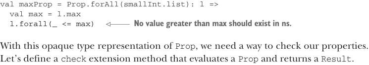
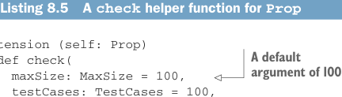

# Страница 0222

[<- Страница 0221](./page-0221) | [Указатель страниц](./) | [Страница 0223 ->](./page-0223)

> Часть 2: Функциональный дизайн и библиотеки комбинаторов /  
> Глава 8: Тестирование на основе свойств /  
> 8.2 Минимизация тестовых случаев /  
> 8.2.2 Несколько простых примеров

## 193 8.2 Минимизация тестовых случаев

http://mng.bz/Pz86).  
Максимум списка должен быть не меньше любого другого элемента в этом списке — как король в своём царстве, ха.  
Давай это свойство зафиксим по-человечески:

```scala
val smallInt = Gen.choose(-10, 10)
```



```scala
val maxProp = Prop.forAll(smallInt.list): l =>
val max = l.max
l.forall(_ <= max)
```

> Ни одно значение больше max в ns быть не должно.  
> Типа, max — это потолок, выше которого ничего не прыгнет.

С этим opaque-типом (opaque type) для `Prop` — чтоб никто не сунул нос внутрь и не подменил значения, — нам нужен способ прогнать свойства на прочность.  
Давай замутим extension-метод (extension method) `check`, который выполнит `Prop` и сплюнет `Result` — прошёл или в могилу.

**Листинг 8.5.** Вспомогательная функция `check` для `Prop`



```scala
extension (self: Prop)
def check(
maxSize: MaxSize = 100,
testCases: TestCases = 100,
rng: RNG = RNG.Simple(System.currentTimeMillis)
): Result =
```

> Аргумент по умолчанию — 100, чтоб не ковыряться каждый раз вручную

```scala
self(maxSize, testCases, rng)
```

А чтоб в REPL (Read-Eval-Print Loop) было как в песочнице — ковыряйся не хочу, — замутим хелпер, который прогоняет наши `Prop` и красивенько печатает результат в консоль, чтоб сразу видно, где собака порылась.

**Листинг 8.6.** Вспомогательная функция `run` для `Prop`

```scala
extension (self: Prop)
def run(maxSize: MaxSize = 100,
testCases: TestCases = 100,
rng: RNG = RNG.Simple(System.currentTimeMillis)): Unit =
self(maxSize, testCases, rng) match
case Falsified(msg, n) =>
println(s"! Falsified after $n passed tests:\n $msg")
  case Passed =>
println(s"+ OK, passed $testCases tests.")
```

Тут мы хакнем default arguments (аргументы по умолчанию) — чтоб методы вызывать было как два пальца, без лишнего гемора.  
Хотим дефолтное число тестов, чтоб покрытие было жирным, как стейк, но не чтоб оно там сутками генерило рандом и кофе допивать заставляло.  
Если попробуем прогнать `check` или `run` на `maxProp`, то свойство наебнётся к херам!  
Тестирование на основе свойств (property-based testing) — это как тот друг, который тыкает в твои слепые зоны: высвечивает скрытые допущения в коде, типа «список же всегда непустой, лол», и заставляет их вынести на свет божий явно.  
Стандартная реализация `max` из стэбла (stdlib) просто крашится на пустом списке — классика, я сам через это прошёл пару раз на проде.  
Надо свойство подлатать под этот прикол.

[<- Страница 0221](./page-0221) | [Указатель страниц](./) | [Страница 0223 ->](./page-0223)
