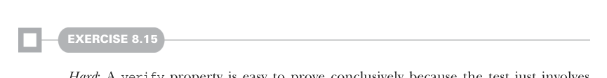

# Страница 0225
[<- Страница 0224](./page-0224) | [Индекс страниц](./) | [Страница 0226 ->](./page-0226)

> Часть 2: Функциональный дизайн и библиотеки комбинаторов / Глава 8: Тестирование на основе свойств / 8.2 Минимизация тестовых случаев / 8.2.3 Пишет тестовый сьют для параллельных вычислений

Нам ещё подкрутить надо имплементации комбинаторов `Prop`, типа `&&`. Изменения — сплошной детский сад, потому что эти комбинаторы не парятся различать `Passed` и `Proved` результаты, им похер на эту херню.



#### УПРАЖНЕНИЕ 8.15

*Сложное*: Свойство `verify` — это вообще раз плюнуть доказать наглухо, потому что тест просто вычисляет аргумент `Boolean`, но некоторые свойства `forAll` тоже можно доказать. Например, если домен свойства — это `Boolean`, то реально всего два кейса проверить. Если свойство `forAll(p)` проходит и для `p(true)`, и для `p(false)`, то оно доказано, блядь. Некоторые домены (вроде `Boolean` и `Byte`) такие мелкие, что их можно перебрать нахуй exhaustively, а с sized-генераторами даже бесконечные домены проверишь до максимального размера. Автотесты — это круто, но если код ещё и автоматически доказывается — вообще пиздец как заебись. Допили нашу библиотеку, чтоб она exhaustive checking для finite доменов и sized-генераторов умела. Это не упражнение, а полноценный дизайн-проект на разогрев, открытый, как жопа после литра пива.

TESTING PAR Возвращаемся к доказыванию свойства, что `Par.unit(1).map(_` `+` `1)` равно `Par.unit(2)`, и юзаем наш свежий примитив `Prop.verify`, чтоб выразить это без запотевания интента, как нормальные пацаны:

```scala
val p2 = Prop.verify:
val p = Par.unit(1).map(_ + 1)
val p2 = Par.unit(2)
p.run(executor).get == p2.run(executor).get
```

Теперь-то заебись ясно, но эта хуйня с `p.run(executor).get` и `p2.run(executor).get` всё равно бесит, как реклама в торрente. Во-первых, заставляем код знать внутренние кишки `Par` только ради сравнения двух `Par` на равенство — это как ебать слона зубочисткой. Один апгрейд — вынести сравнение равенства в `Par` через `map2`, и хватит одного `Par` в конце, чтоб получить результат:

```scala
def equal[A](p: Par[A], p2: Par[A]): Par[Boolean] =
p.map2(p2)(_ == _)
val p3 = Prop.verify:
equal(
Par.unit(1).map(_ + 1),
Par.unit(2)
).run(executor).get
```

Это уже по-приличнее, чем запускать каждую сторону по отдельности, как лохов. Можем даже `equal` с `forAll` замиксовать:

[<- Страница 0224](./page-0224) | [Индекс страниц](./) | [Страница 0226 ->](./page-0226)
