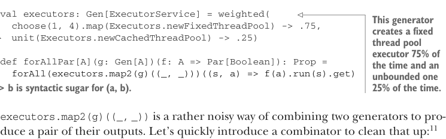
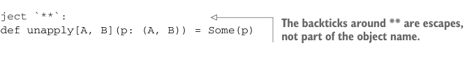

# Страница 0226
[<- Страница 0225](./page-0225) | [Индекс страниц](./) | [Страница 0227 ->](./page-0227)

> Часть 2: Функциональный дизайн и библиотеки комбинаторов / Глава 8: Тестирование на основе свойств / 8.2 Минимизация тестовых случаев / 8.2.3 Написание тестового набора для параллельных вычислений

## 197 8.2 Минимизация тестовых случаев

```scala
val p4 = Prop.forAll(Gen.smallInt): i =>
  equal(
    Par.unit(i).map(_ + 1),
    Par.unit(i + 1)
  ).run(executor).get
```

А раз уж мы тут ковыряемся, давай вынесем выполнение `Par` в отдельную функцию: `forAllPar`. 
Это даст нам идеальное место, чтоб впихнуть вариации по разным параллельным стратегиям, 
не превращая нашу чистую проперти в свалку кода:



```scala
val executors: Gen[ExecutorService] = weighted(
  choose(1, 4).map(Executors.newFixedThreadPool) -> .75,
  unit(Executors.newCachedThreadPool) -> .25
)
```

> Этот генератор 75% времени лепит фиксированный пул потоков (fixed thread pool executor), 
> а 25% — неограниченный (unbounded). `a -> b` — это синтаксический сахар для `(a, b)`.

```scala
def forAllPar[A](g: Gen[A])(f: A => Par[Boolean]): Prop =
  forAll(executors.map2(g)((_, _)))((s, a) => f(a).run(s).get)
```

`executors.map2(g)((_, _))` — это пиздец какой шумный способ слепить два генератора 
в пару их выходов. Давай быстро замутим комбинатор, чтоб это отшлифовать:<sup>11</sup>


> Аннотация `targetName` даёт альтернативное, алфанумериковое имя для символьного оператора. 
> Всегда считается хорошим тоном лепить алфанумерик-дубликат для каждого такого оператора 
> — чтоб IDE не бесилась и стэк-трейсы читабельны.

```scala
extension [A](self: Gen[A])
  @annotation.targetName("product")
  def **[B](gb: Gen[B]): Gen[(A, B)] =
    map2(gb)((_, _))
```

Это куда как приятнее:

```scala
def forAllPar[A](g: Gen[A])(f: A => Par[Boolean]): Prop =
  forAll(executors ** g)((s, a) => f(a)(s).get)
```

Мы даже можем впихнуть `**` как паттерн через кастомный экстрактор — и писать станет так:

```scala
def forAllPar[A](g: Gen[A])(f: A => Par[Boolean]): Prop =
  forAll(executors ** g):
    case s ** a =>
      f(a)(s).get
```

Этот синтаксис заебись ложится, когда ту плышь кучу генераторов; при матчинге не придётся 
гнездить скобки вложенными матрёшками, как с прямым tuple-паттерном. 
Чтоб разжечь `**` как паттерн, определяем объект по имени `**` с функцией `unapply`:



```scala
object `**`:
```

> Бэктики вокруг ** — это экранирования, а не часть имени объекта, чтоб компилятор не охуел.

```scala
def unapply[A, B](p: (A, B)) = Some(p)
```

<sup>11</sup> Называть это `**` — в самый раз, потому что функция берёт *продукт* двух генераторов, 
в том смысле, как мы ковыряли в третьей главе — помните, там про категорию и монады было, 
чтоб не путаться в скобках.

[<- Страница 0225](./page-0225) | [Индекс страниц](./) | [Страница 0227 ->](./page-0227)
