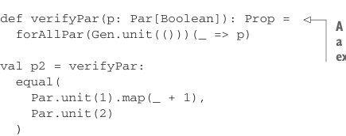

# Страница 0227
[<- Страница 0226](./page-0226) | [Индекс страниц](./) | [Страница 0228 ->](./page-0228)

> Часть 2: Функциональный дизайн и библиотеки комбинаторов /  
> Глава 8: Тестирование на основе свойств /  
> 8.2 Минимизация тестовых случаев /  
> 8.2.3 Пишем тестовый сьют для параллельных вычислений

Загляни в доки по кастомным экстракторам (http://mng.bz/4pUc), там вся подноготная этой техники.  
Короче, `executors` — это `Gen[ExecutorService]`, который нагенерит пулы потоков фиксированного размера  
от 1 до 4 тредов плюс unbounded (неограниченный) в придачу, чтоб не скучно было.  
Теперь наше свойство выглядит заебись чистым.[^12]



```scala
def verifyPar(p: Par[Boolean]): Prop =
forAllPar(Gen.unit(()))(_ => p)
```

> Вариант verify, который жрёт Par[Boolean] и тестует свойство на разных экзекьюторах

```scala
val p2 = verifyPar:
equal(
Par.unit(1).map(_ + 1),
Par.unit(2)
)
```

На первый взгляд — хуйня мелкая, но такая факторизация с чисткой — это как апгрейд от Жигулей к Tesla  
для usability либы. Хелперы (helpers), что мы накатали, делают свойства читаемыми, как свежий пул-реквест  
без говнокода, и писать их — чистый кайф. Можно заодно `forAllPar`-версию для sized-генераторов допилить,  
не поленись.  

Давай глянем другие свойства из главы 7. Вспомним, обобщили мы тест-кейс до такого:

```scala
unit(x).map(f) == unit(f(x))
```

Потом упростили до закона: map с identity над компьютацией — нихуя не меняет:

```scala
y.map(x => x) == y
```

А выразить это сможем? Не на все сто. Свойство tacitly (неявно) намекает, что эквивалентность  
держится для любых выборов `y` и всех типов подряд. Приходится хардкодить конкретные значения  
для `y` — классический подвох, через который все проходят:

```scala
val gpy: Gen[Par[Int]] = Gen.choose(0,10).map(Par.unit(_))
val p5 = Prop.forAllPar(gpy)(py => equal(py.map(y => y), py))
```

Больше вариантов для `y` нагенерить — запросто, но и так сойдёт, не переборщи.  
Имплементация `map` похуй на значения нашей параллельной компьютации, так что дублировать тесты  
для `Double`, `String` и прочей хуйни — бессмысленная трата времени.  
Структура параллельной компьютации может влиять на `map`, это да.  
Хочешь железобетонной уверенности — богатей генераторы для структуры.  
А тут мы фигачим только `Par`-выражения с одним уровнем вложенности, чтоб не улететь в космос.

[<- Страница 0226](./page-0226) | [Индекс страниц](./) | [Страница 0228 ->](./page-0228)

[^12]: Нельзя юзать стандартный Java/Scala-метод `equals` или Scala-`==` (который делегирует в `equals`),  
потому что он возвращает `Boolean` напрямую, а нам нужен `Par[Boolean]`.
