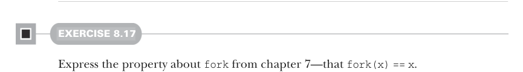
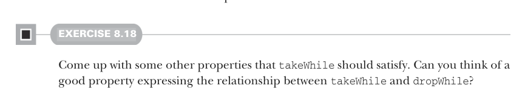
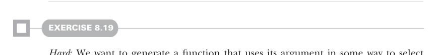

# Страница 0228
[<- Страница 0227](./page-0227) | [Индекс страниц](./) | [Страница 0229 ->](./page-0229)

> Часть 2: Функциональный дизайн и библиотеки комбинаторов / Глава 8: Тестирование на основе свойств / 8.3 Тестирование функций высшего порядка и будущие направления

## 199 8.3 Тестирование функций высшего порядка и будущие направления

#### УПРАЖНЕНИЕ 8.16

*Хардкор*: Напиши генератор для `Par[Int]` понасыщеннее, чтоб он строил глубоко вложенные параллельные вычисления, а не те плоские хуйни, что мы накидали раньше. Как матрёшка из параллелек, чтоб рекурсия аж зубы сводила.

#### УПРАЖНЕНИЕ 8.17

Вырази свойство про `fork` из главы 7 — что `fork(x) == x`. Не забудь, как мы там ковырялись в монадах, чтоб не профукать.

### 8.3 Тестирование функций высшего порядка и будущие направления

Пока наша lib выглядит как танк — выразительная до усрачки, но есть жирная дыра: тестировать функции высшего порядка нихуя не выходит. Генерим данные пачками через генераторы, а вот сами функции генерить? Сплошной пиздец, как пытаться симулировать колдуна без заклинаний. Возьмём `takeWhile` для `List` и `LazyList`. Помните, эта хрень отрезает самый длинный префикс, где все элементы предикату кивают — типа `List(1, 2, 3).takeWhile(_ < 3)` даёт `List(1, 2)`. Простое свойство, чтоб чекнуть: для любого списка `as: List[A]`, и любого `f: A => Boolean`, выражение `as.takeWhile(f).forall(f)` всегда `true`. То бишь, каждый элемент в возвращённом списке предикату true машет.13 Как будто говорим: "Эй, префикс, не пизди, все твои пацаны чисты!"

#### УПРАЖНЕНИЕ 8.18

Прикинь другие свойства, которые `takeWhile` должна соблюдать. Есть ли годное свойство, что связывает `takeWhile` и `dropWhile`? Типа, чтоб не просто forall, а с леммой про длину или хвост — покопай, где подвох.

#### УПРАЖНЕНИЕ 8.19

*Хардкор*: Хотим генерить функцию, которая аргумент юзает, чтоб решить, какой `Int` слать обратно. Как это оформить? Полностью открытый квест, мозг сломаешь. Поковыряйся в этой хуйне, может, универсальное решение для нашей lib выковыряешь — как апгрейд для всей фермы.

13 В стандартной Scala-либе `forall` — метод на `List` и `LazyList` с сигнатурой `def forall[A](f: A => Boolean): Boolean`.

[<- Страница 0227](./page-0227) | [Индекс страниц](./) | [Страница 0229 ->](./page-0229)
