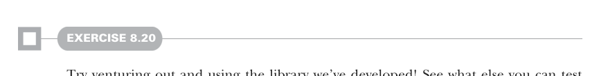

# Страница 0229
[<- Страница 0228](./page-0228) | [Индекс страниц](./) | [Страница 0230 ->](./page-0230)

> Часть 2: Функциональный дизайн и библиотеки комбинаторов / Глава 8: Тестирование на основе свойств / 8.4 Законы генераторов



#### УПРАЖНЕНИЕ 8.20

Давай, пацаны, выходите в дикий мир и юзайте эту библиотеку, которую мы наковыряли! Посмотрите, что ещё можно ею потестить, может, новые идиомы откопаете или способы её доработать, чтоб удобнее было — типа, расширить или упростить API под реальный прод. Вот парочка идей на разгоночку, чтоб не с нуля копать:

- Напишите свойства, чтоб описать поведение некоторых других функций, которые мы запилили для `List` и `LazyList` — ну, например, `take`, `drop`, `filter` и `unfold`.

- Запилите sized-генератор для типа данных `Tree` из главы 3, а потом юзайте его, чтоб описать поведение функции `fold`, которую мы мутили для `Tree`. Можете подумать, как API подкрутить, чтоб проще было этим заниматься?

- Напишите свойства для описания поведения функции `sequence`, которую мы определяли для `Option` и `Either`.

### 8.4 Законы генераторов

Забавно, блядь, не находите? Куча функций, которые мы запилили для нашего типа `Gen`, выглядят как близнецы-братья тех, что мы мутили раньше для `Par`, `List`, `LazyList` и `Option`. Возьмём для примера `Par` — вот что мы там наворотили:

```scala
extension [A](pa: Par[A]) def map[B](f: A => B): Par[B]
```

А в этой главе мы аналогично `map` для `Gen` определяли:

```scala
extension [A](ga: Gen[A])
  def map[B](f: A => B): Gen[B]
```

Мы ещё похожие функции накидали для `Option`, `List`, `LazyList` и `State`. И вот невольно задумаешься: это просто сигнатуры копипаста-подобные, или они ещё и те же самые законы выполняют? Давайте глянем на закон, который мы вводили для `Par` в главе 7:

```scala
y.map(id) == y
```

А держится ли этот закон в нашей имплементации `Gen.map`? А как насчёт `LazyList`, `List`, `Option` и `State`? Да, держится на ура! Попробуйте сами, потестируйте — увидите. Это намекает, что не только сигнатуры похожи, но и смысл в своих доменах у них аналогичный, как будто из одной матрицы вылупились. Тут явно глубже копалка — фундаментальные паттерны на уровне, которые домены насквозь прорезают, как нож масло. В части 3 разберём их имена, законы, по которым они пляшут, и поймём, что к чему.

[<- Страница 0228](./page-0228) | [Индекс страниц](./) | [Страница 0230 ->](./page-0230)
