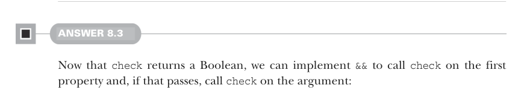

# Страница 0231
[<- Страница 0230](./page-0230) | [Индекс страниц](./) | [Страница 0232 ->](./page-0232)

> Часть 2: Функциональный дизайн и библиотеки комбинаторов / Глава 8: Тестирование на основе свойств / 8.6 Ответы на упражнения

- Если протестировать **каждый возможный** вход для свойства и все пройдут — то свойство **доказано** истинным, как теорема в книге. А если просто не обосралось ни на одном сгенерированном тесте — то passed (прошло), но где-то в тени может прятаться тот самый вход, который всё сломает к хуям.
- Комбинаторы вроде `map` и `flatMap` так и лезут везде в наших дата-типах, и их имплементации держат те же монадные законы — identity (identity law) и composition (composition law), без подвохов.


### 8.6 Ответы на упражнения

#### ОТВЕТ 8.1

- Сумма пустого списка — ноль, `sum(Nil)` `==` `0`. Базовый кейс, без него вся рекурсия в жопе.
- Сумма списка, где все элементы — `x`, равна длине списка умноженной на `x`: `sum(List.fill(n)(x))` `==` `n` `*` `x`. Как стадо одинаковых овец.
- Для любого списка `xs` сумма равна сумме его реверса: `sum(xs)` `==` `sum(xs.reverse)`. Потому что сложение коммутативно, порядок нахуй не нужен.
- Для любого `xs`, если разрезать на две части, просуммировать каждую и сложить результаты — выйдет та же сумма. Ассоциативность сложения в деле, как склейка Lego без зазоров.
- Сумма списка 1, 2, 3…`n` — это `n*(n+1)/2`. Формула Гаусса, школьная классика, но в Scala без переполнения, бля.


#### ОТВЕТ 8.2

- Макс пустого списка — ошибка, `MaxOfEmpty` (MaxOfEmpty exception) или что там у вас. Nil не имеет короля.
- Макс списка из одного элемента — сам этот элемент. Тривиально, как 2+2.
- Макс списка, где все элементы `x` — это `x`. Все равны, выбирай любого.
- Макс списка — один из элементов списка. Не выдумывай из воздуха, бери реальный.
- Макс >= любого элемента в списке. По определению, сука, иначе нахрена он макс.



#### ОТВЕТ 8.3

Теперь, когда `check` возвращает Boolean, имплементируем `&&` так: вызываем `check` на первом свойстве, и если прошло — валим `check` на втором аргументе:

```scala
trait Prop:
  self =>
    def check: Boolean
    def &&(that: Prop): Prop =
      new Prop:
        def check = self.check && that.check
```

> Этот синтаксис вводит алиас для `this`, чтоб потом ссылаться на внешний экземпляр Prop. Без него сам себя не найдешь в замыканиях.

[<- Страница 0230](./page-0230) | [Индекс страниц](./) | [Страница 0232 ->](./page-0232)
