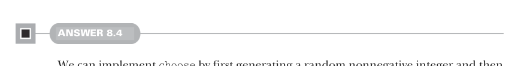
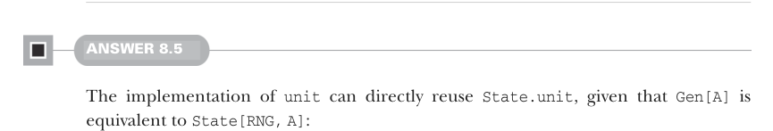
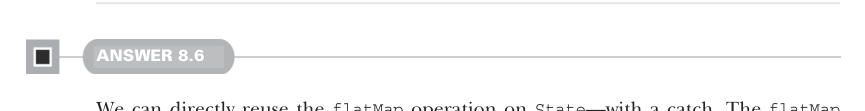

# Страница 0232
[<- Страница 0231](./page-0231) | [Индекс страниц](./) | [Страница 0233 ->](./page-0233)

> Часть 2: Функциональный дизайн и библиотеки комбинаторов / Глава 8: Тестирование на основе свойств / 8.6 Ответы на упражнения

## 203 8.6 Ответы на упражнения



#### РЕШЕНИЕ 8.4

Можем заимплементить `choose`, сначала нагенерив рандомный неотрицательный инт, а потом сдвинув его в запрошенный диапазон — классика, как в старом добром RNG-танце. Поскольку `Gen[A]` — это непрозрачный тип для `State[RNG, A]`, приходится возвращать state action, где `RNG` — тип состояния. Вспомните фичу `nonNegativeInt` из шестой главы, сигнатура у неё `def nonNegativeInt(rng: RNG): (Int, RNG)`. Обернем её в `State` — и вуаля, state action для неотрицательного инта. Дальше map'нем функцией, которая сдвинет инт в правильный диапазон, без лишнего геморроя:

```scala
def choose(start: Int, stopExclusive: Int): Gen[Int] =
  State(RNG.nonNegativeInt).map(n => start + n % (stopExclusive - start))
```



#### РЕШЕНИЕ 8.5

Заимплеменить `unit` — проще простого, переиспользуем `State.unit`, ведь `Gen[A]` эквивалентно `State[RNG, A]`, никаких сюрпризов:

```scala
def unit[A](a: => A): Gen[A] =
  State.unit(a)
```

Аналогично, `boolean` берёт определение `RNG.boolean` с сигнатурой `def boolean(rng: RNG): (Boolean, RNG)`. Как и с `nonNegativeInt`, просто оборачиваем в state action — и готово, без лишних телодвижений:

```scala
def boolean: Gen[Boolean] =
  State(RNG.boolean)
```

Самая хитрая хрень — `listOfN`. Сначала создаём список из `n` элементов, где каждый — это наш генератор. Получаем `List[Gen[A]]`, но поскольку `Gen[A] = State[RNG, A]`, это на деле `List[State[RNG, A]]`. Зная это, юзаем `State.sequence`, чтоб перевернуть `Gen` и `List` — и вот тебе нужный `Gen[List[A]]`, как по маслу:

```scala
extension [A](self: Gen[A]) def listOfN(n: Int): Gen[List[A]] =
  State.sequence(List.fill(n)(self))
```



#### РЕШЕНИЕ 8.6

Можем напрямую переиспользовать операцию `flatMap` на `State` — но с подвохом, как всегда в Scala. Метод-расширение `flatMap`, который мы определяем, имеет приоритет над методом-расширением `flatMap` на `State`. Поэтому естественное выражение `ga.flatMap(f)` не вызывает

[<- Страница 0231](./page-0231) | [Индекс страниц](./) | [Страница 0233 ->](./page-0233)
