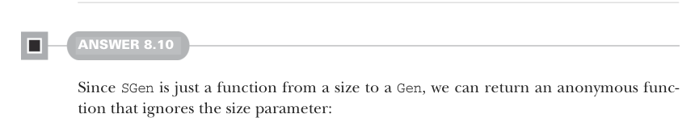

# Страница 0235

[<- Страница 0234](./page-0234) | [Индекс страниц](./) | [Страница 0236 ->](./page-0236)

> Часть 2: Функциональный дизайн и библиотеки комбинаторов / Глава 8: Тестирование на основе свойств / 8.6 Ответы на упражнения

```scala
extension (self: Prop) def tag(msg: String): Prop =
(n, rng) => self(n, rng) match
case Falsified(e, c) => Falsified(FailedCase.fromString(s"$msg($e)"), c)
case x => x
```

Эта реализация просто оборачивает оригинальное сообщение об ошибке в то, что ты впихнул в `tag`, но если не лениться и заморочиться по-взрослому, можно перелопатить тип `Falsified` под что-то посочнее — стек или дерево выражений, чтоб как в нормальном дебаггере, а не хуйня на постном масле. Ещё и не забывай юзать `tag` в имплементации `&&` и `||`, иначе сам себя подставишь:

```scala
extension (self: Prop) def &&(that: Prop): Prop =
(n, rng) => self.tag("and-left")(n, rng) match
case Passed => that.tag("and-right")(n, rng)
case x => x
extension (self: Prop) def ||(that: Prop): Prop =
(n, rng) => self.tag("or-left")(n, rng) match
case Falsified(msg, _) =>
that.tag("or-right").tag(msg.string)(n, rng)
case x => x
```

Теперь наши сообщения об ошибках хотя бы намекают, где именно в свойствах всё пошло по пизде:

```scala
scala> (p && q).run()
! Falsified after 4 passed tests:
and-right(false)
scala> (q && p).run()
! Falsified after 1 passed tests:
and-left(false)
scala> (q || q).run()
! Falsified after 2 passed tests:
or-left(false)(or-right(false))
```



#### ОТВЕТ 8.10

Раз `SGen` — это всего навсего функция от размера к `Gen`, то лепим анонимку, которая этот размер нахуй игнорит и делает ровно то, что надо:

```scala
extension [A](self: Gen[A]) def unsized: SGen[A] =
_ => self
```


#### ОТВЕТ 8.11

Сначала замутим `map`, без него никуда:

```scala
extension [A](self: SGen[A]) def map[B](f: A => B): SGen[B] =
n => self(n).map(f)
```

[<- Страница 0234](./page-0234) | [Индекс страниц](./) | [Страница 0236 ->](./page-0236)
