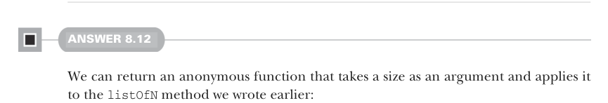

# Страница 0236
[<- Страница 0235](./page-0235) | [Индекс страниц](./) | [Страница 0237 ->](./page-0237)

> Часть 2: Функциональный дизайн и библиотеки комбинаторов / Глава 8: Тестирование на основе свойств / 8.6 Ответы на упражнения

## 207 8.6 Ответы на упражнения

Реализацию можно вывести чисто по типам, без всякой лишней хуйни — типы сами подскажут, куда копать.  
Нам надо вернуть `SGen[B]`, так что лепим анонимку: жрёт size (`n`) и выдаёт `Gen[B]`.  
Чтобы сгенерить `Gen[B]`, пихаем этот size в оригинальный `SGen[A]` — и получаем `Gen[A]`, как по маслу.  
Наконец, юзаем нашу `map` на `Gen`, чтоб этот `Gen[A]` перекинуть в `Gen[B]`.  
Вот такая тип-направленная сборка — это и есть то, что мы зовём *механической*, как робот на конвейере без души, но с гарантией.  
Давай ещё одну для закрепления — `flatMap`:

```scala
extension [A](self: SGen[A]) def flatMap[B](f: A => SGen[B]): SGen[B] =
n => self(n).flatMap(a => f(a)(n))
```

По той же схеме: возвращаем анонимку, которая хапает size и выдаёт `Gen[B]`.  
Пихаем size в наш базовый `SGen[A]` — бац, `Gen[A]` готов.  
Теперь зовём `flatMap` на этом `Gen[A]`, но просто так `f` не впихнёшь в `flatMap`, как мы делали с `map`; `flatMap` ждёт функцию `A => Gen[B]`.  
Так что лепим лямбду: сначала `a` на `f` — получаем `SGen[B]`, а потом size в этот `SGen[B]`, чтоб выдать финальный `Gen[B]`.  
Типы — как строгий тимлид, не обманешь.



#### ОТВЕТ 8.12

Можем слепить анонимку, которая жрёт size в аргументах и пихает его прямиком в метод `listOfN`, который мы раньше накатали:

```scala
extension [A](self: Gen[A]) def list: SGen[List[A]] =
n => self.listOfN(n)
```


#### ОТВЕТ 8.13

Берём ту же реализацию, что и для `listOf`, но добавляем чек, чтоб size, который летит в `listOfN`, был не меньше `1` — чтоб не словить NPE (NullPointerException) во время выполнения, как я в 2010-м на проде:

```scala
extension [A](self: Gen[A]) def nonEmptyList: SGen[List[A]] =
n => listOfN(n.max(1))
val maxProp = Prop.forAll(smallInt.nonEmptyList): ns =>
val max = ns.max
!ns.exists(_ > max)
scala> maxProp.run()
+ OK, passed 100 tests.
```

[<- Страница 0235](./page-0235) | [Индекс страниц](./) | [Страница 0237 ->](./page-0237)
