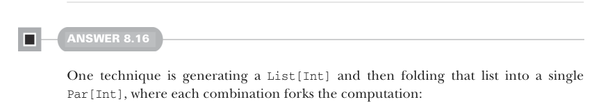

# Страница 0239
[<- Страница 0238](./page-0238) | [Индекс страниц](./) | [Страница 0240 ->](./page-0240)

> Часть 2: Функциональный дизайн и библиотеки комбинаторов / Глава 8: Тестирование на основе свойств / 8.6 Ответы на упражнения

Вот пример использования, пацаны:

```scala
scala> val andCommutative =
Prop.forAll(Gen.boolean.map2(Gen.boolean)((_, _))):
(p, q) => (p && q) == (q && p))
scala> andCommutative.run()
+ OK, property proven, ran 4 tests.
```

Код в гитхаб-репозитории, который в комплекте, дорабатывает эту тему под sized-генераторы — чтоб не просто так болталось.



#### ОТВЕТ 8.16

Один приём — нагенерить список `List[Int]`, а потом фолдить его в единственный `Par[Int]`, где каждая комбинация форкает вычисления, как в кошмаре параллельного кода на кофе-брейке:

```scala
val gpy2: Gen[Par[Int]] =
choose(-100, 100).listOfN(choose(0, 20)).map(ys =>
ys.foldLeft(Par.unit(0))((p, y) =>
Par.fork(p.map2(Par.unit(y))(_ + _))))
```

Генерим `Gen[List[Int]]` через `choose(-100,` `100).listOfN(choose(0,` `20))`. Потом мапим по этому генератору и редуцим список в один `Par[Unit]` с помощью `fork` и `map2` — чистый комбинаторный дзен. А чтоб не ебаться повторно, выносим generic фичу на списках под `parTraverse` и лепим на неё наш генератор, как конструктор Лего в руках FP-маньяка:

```scala
extension [A](self: List[A])
def parTraverse[B](f: A => Par[B]): Par[List[B]] =
self.foldRight(Par.unit(Nil: List[B]))((a, pacc) =>
Par.fork(f(a).map2(pacc)(_ :: _)))
val gpy3: Gen[Par[Int]] =
choose(-100, 100).listOfN(choose(0, 20)).map(ys =>
ys.parTraverse(Par.unit).map(_.sum))
```


#### ОТВЕТ 8.17

Это можно выразить прямиком через `forAllPar` и `Gen[Par[Int]]`, которую мы раньше накатали — никаких лишних телодвижений, чистая элегантность после 16 лет ебли с такими штуками:

```scala
val forkProp = Prop.forAllPar(gpy2)(y => equal(Par.fork(y), y))
```

[<- Страница 0238](./page-0238) | [Индекс страниц](./) | [Страница 0240 ->](./page-0240)
