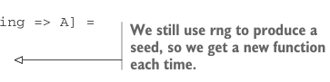

# Страница 0241

[<- Страница 0240](./page-0240) | [Указатель страниц](./) | [Страница 0242 ->](./page-0242)

> Часть 2: Функциональный дизайн и библиотеки комбинаторов / Глава 8: Property-based testing / 8.6 Ответы на упражнения


#### ОТВЕТ 8.19

Пацаны, давайте стартанём с подписи нашего мотивирующего примера — генерим функцию `String` `=>` `Int`, опираясь на `Gen[Int]`:

```scala
def genStringIntFn(g: Gen[Int]): Gen[String => Int]
```

Теперь обобщим это дерьмо, чтоб не зацикливаться на `Int`, а то можно наебать систему (типа, просто вернуть `hashCode` входного `String`, который как назло является `Int`):

```scala
def genStringFn[A](g: Gen[A]): Gen[String => A]
```

Мы уже отсеяли вариант с функцией, которая плюёт на входной `String` — это ж скучно, как корпоративный митинг! Нет, нам надо юзать инфу из входного `String`, чтоб влиять на то, какую именно `A` мы генерим. Как это провернуть? Единственный рычаг на то, что выплёвывает `Gen` — это подкрутка `RNG`, который она жрёт на входе. Вспомним определение `Gen`:

```scala
opaque type Gen[+A] = State[RNG, A]
```

Просто следуя типам, как по рельсам, пишем вот так:

```scala
def genStringFn[A](g: Gen[A]): Gen[String => A] =
State[RNG, String => A]: rng => ???
```

`???` должен быть типа `(String` `=>` `A,` `RNG)`, и вдобавок хотим, чтоб `String` как-то влиял на генерируемую `A`. Делаем это, подмикшивая сид в `RNG` перед тем, как скормить его сэмпл-функции `Gen[A]`. Простой способ — хэш от входной строки, мешаем его в стейт `RNG` и генерим `A`:



```scala
def genStringFn[A](g: Gen[A]): Gen[String => A] =
State[RNG, String => A]: rng =>
val (seed, rng2) = rng.nextInt
val f = (s: String) =>
g.run(RNG.Simple(seed.toLong ^ s.hashCode.toLong))(0)
(f, rng2)
```

> Мы всё равно юзаем rng для сида, так что каждый раз новая функция вылетает.

Более общо, подойдёт любая функция, которая жрёт `String` и `RNG`, а на выходе сплёвывает свежий `RNG`. Тут мы берём `hashCode` от `String` и XOR'им с сидом для нового `RNG`. Могли б взять длину `String` и ею потревожить стейт RNG, или первые три символа строки — как угодно. Выбор влияет на тип функции, которую мы лепим, как специи в борщ:

[<- Страница 0240](./page-0240) | [Указатель страниц](./) | [Страница 0242 ->](./page-0242)
