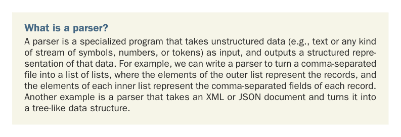

# Страница 0243

[<- Страница 0242](./page-0242) | [Индекс страниц](./) | [Страница 0244 ->](./page-0244)

> Часть 2: Функциональный дизайн и библиотеки комбинаторов / Глава 9: Комбинаторы парсеров

*Комбинаторы парсеров*

### В этой главе мы разберём

Знакомство с комбинаторами парсеров

Проектирование и использование API без реализаций

В этой главе мы поэтапно разберём дизайн библиотеки комбинаторов для создания *парсеров*. JSON-парсинг (http://mng.bz/DpNA) возьмём как типичный кейс, чтоб было понятно, зачем эта херня нужна в реальной жизни. Как и в главах 7 и 8, здесь не про парсинг как таковой — это больше про то, как функционально проектировать, чтоб не утонуть в императивной трясине, как слон в болоте.

Что такое парсер? Парсер — это специализированная программа, которая берёт неструктурированные данные (типа текста или любого потока символов, чисел или токенов) на вход и выдаёт на выходе структурированное представление этих данных. Например, можно наклепать парсер, который из CSV-файла с запятыми слепит список списков: внешний список — это записи, а внутренние — поля каждой записи, разбитые по запятым. Ещё пример — парсер, который XML или JSON-document превращает в древовидную структуру данных, чтоб не ковыряться руками в этой каше.

**214**

[<- Страница 0242](./page-0242) | [Индекс страниц](./) | [Страница 0244 ->](./page-0244)
