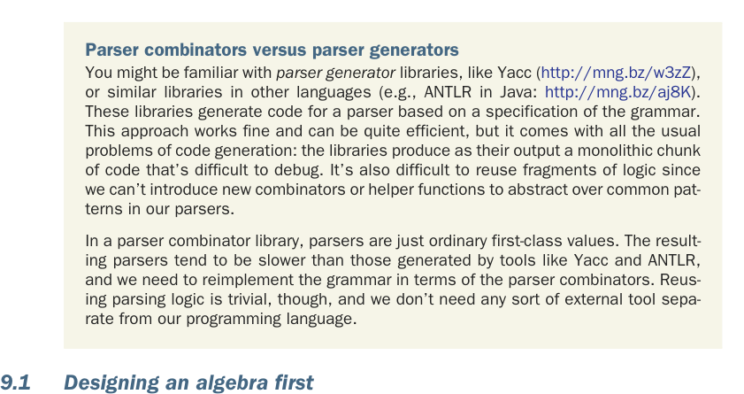

# Страница 0244
[<- Страница 0243](./page-0243) | [Индекс страниц](./) | [Страница 0245 ->](./page-0245)

> Часть 2: Функциональный дизайн и библиотеки комбинаторов /  
> Глава 9: Комбинаторы парсеров /  
> 9.1 Сначала проектируем алгебру

## 215 9.1 Сначала проектируем алгебру

В библиотеке комбинаторов парсеров, которую мы слепим в этой главе, парсер — это не какая-то хуйня космически сложная, и ему не обязательно жрать целые документы целиком. Достаточно элементарной хуйни — признать один сраный символ в инпуте. А потом комбинаторами, как лего-бриками из гаража деда, собираем из этих базовых составные парсеры, а из тех — ещё пиздец какие хитрые.

Эта глава покажет подход к дизайну, который мы окрестим *алгебраическим дизайном*. Это просто логичная эволюция того, что мы уже мутили в прошлых главах — с разной степенью фанатизма лепили интерфейс первым делом, с законами в придачу, а типы данных под него подгоняли, чтоб не выебываться потом. В паре ключевых моментов тут будут открытые упражнения, чтоб вы прям почувствовали вкус реальной жизни: пишете свою библиотеку с нуля, без подсказок. Максимум кайфа от главы — если отложите книгу и сами поковыряетесь в подходах. В продакшене никто вам не поднесёт на блюдечке идеально подобранные сигнатуры типов, чтоб вы их просто имплементили. Придётся самим решать, какие типы и комбинаторы нужны, и цель второй части книги как раз — натаскать вас на это соло. Как всегда, если застряли в упражнении или идеи кончились — листайте дальше или чекните ответы. Ещё вариант — мутите с напарником или шерьтесь заметками с другими читателями в сети, как на том же реддите в /r/scala.

### Комбинаторы парсеров против генераторов парсеров

Вы наверняка в теме *генераторов парсеров* (parser generators), типа Yacc (http://mng.bz/w3zZ) или аналогов в других языках (ANTLR (http://mng.bz/aj8K) в Java). Эти твари генерят код парсера по спецификации грамматики. Работает заебись, эффективно, но с классическими косяками кодогенерации: на выходе монолитный кусок дерьма, который дебажить — как зубы без анестезии. Переиспользовать фрагменты логики? Забудьте, новых комбинаторов или хелперов не впихнёшь, чтоб абстрагировать паттерны.

В библиотеке комбинаторов парсеры — обычные first-class ценности (first-class values), как твои Stream'ы или Option'ы. Получается медленнее, чем у Yacc'а с ANTLR'ом, грамматику переписывать вручную приходится, но переиспользование логики — на раз-два, и никаких внешних тулов вне языка не надо, всё в одном флаконе.

### 9.1 Сначала проектируем алгебру

Вспомним: *алгебра* — это набор функций, которые ебутся над какими-то типами данных, плюс законы, описывающие, как эти функции между собой дружат (или дерутся). В прошлых главах мы довольно плавно прыгали от изобретения функций в алгебре,

[<- Страница 0243](./page-0243) | [Индекс страниц](./) | [Страница 0245 ->](./page-0245)
