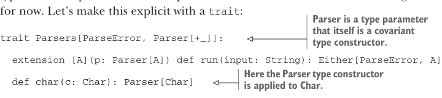

# Страница 0246
[<- Страница 0245](./page-0245) | [Индекс страниц](./) | [Страница 0247 ->](./page-0247)

> Часть 2: Функциональный дизайн и библиотеки комбинаторов /  
> Глава 9: Комбинаторы парсеров /  
> 9.1 Сначала проектируем алгебру

## 217 9.1 Сначала проектируем алгебру

Парсер `char('a')` отработает только если на входе ровно символ `'a'`,  
и выплюнет этот самый `'a'` как результат. Этот треп про *запуск парсера*  
сразу показывает: нашу алгебру надо доработать, чтоб она такое тянула,  
иначе пиздец. Давай слепим ещё одну функцию для этого:

```scala
extension [A](p: Parser[A]) def run(input: String): Either[ParseError, A]
```

Стоп-стоп, а что за хуйня такая `ParseError`? Это ещё один тип, который мы  
только что из жопы достали на код-ревью! Пока нам похуй на его внутренности  
— и на `Parser` тоже. Мы сейчас интерфейс проектируем, который юзает два типа,  
а их репку и impl-details оставляем на "потом, когда припрут". Давай это явно  
оформим через `trait` (trait), чтоб не было недопониманий:



> `Parser` — это параметр типа, который сам по себе ковариантный конструктор типов.

```scala
trait Parsers[ParseError, Parser[+_]]:
extension [A](p: Parser[A]) def run(input: String): Either[ParseError, A]
```

> Здесь конструктор типа `Parser` применяется к `Char`.

```scala
def char(c: Char): Parser[Char]
```

Что за прикол с этим кривым `Parser[+_]` в аргументах? Пока не суть важно,  
но это скалевский синтаксис для параметра типа, который сам конструктор типов[^5].  
`ParseError` как параметр — и интерфейс `Parsers` работает с любой его реализацией,  
типа free (free) или concrete (concrete). А `Parser[+_]` параметром — и с любым  
`Parser`ом тоже, хоть State (State), хоть Reader (Reader). Подчёркивание просто  
значит: что бы `Parser` ни был, он жрёт один аргумент типа для результата,  
как `Parser[Char]`. Этот код компилится на раз-два, без единой concrete-имплементации.  
Не парься с репкой `ParseError` или `Parser` — кидай дальше комбинаторы в тело трейта.  

Наша `char` должна подчиняться очевидному закону: для любого `Char` `c`

```scala
char(c).run(c.toString) == Right(c)
```

Продолжим в том же духе. Можем одиночный `'a'` слопать, но если жрать  
всю хуйню вроде `"abracadabra"`? Способа строк целиком распознавать нет,  
так что добавим:

```scala
def string(s: String): Parser[String]
```

И тут тоже очевидный закон должен быть: для любой `String` `s`

```scala
string(s).run(s) == Right(s)
```

А если хотим или `"abra"`, или `"cadabra"` — выбор такой, блядь? Можем слепить  
ультра-специфический комбинатор под это дело:

```scala
def orString(s1: String, s2: String): Parser[String]
```

[^5]: Мы ещё дохуя про это наговорим в следующих главах.

[<- Страница 0245](./page-0245) | [Индекс страниц](./) | [Страница 0247 ->](./page-0247)
