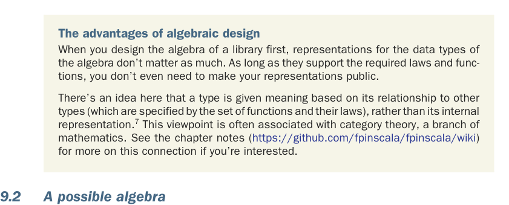
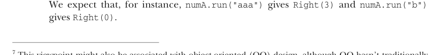

# Страница 0249
[<- Страница 0248](./page-0248) | [Индекс страниц](./) | [Страница 0250 ->](./page-0250)

> Часть 2: Функциональный дизайн и библиотеки комбинаторов / Глава 9: Комбинаторы парсеров / 9.2 Возможная алгебра

Покопайтесь в мозгах, набросайте комбинаторы и возможные законы по этим наводкам — как на код-ревью, когда пацаны давят: "давай, шевели извилинами". Застряли в жопе, как я когда-то с первым парсером, или дошли до точки, где "пиздец, годно" — валите дальше. Следующая секция разберёт один вариант по косточкам, шаг за шагом, чтоб не было "а где подвох?".7



Преимущества алгебраического дизайна. Когда сначала лепишь алгебру библиотеки — это как фундамент дома: репры типов данных потом похуй, лишь бы законы держались и функции рубили. Не то что в imperative-шняге, где внутри всё намутачено и invariants летят к чертям. Репры можно вообще в тени спрятать, чтоб никто не ковырял.

Тут идея в том, что тип обретает смысл не от своей кишок (internal representation, как в том меме с чёрным ящиком), а от связей с другими типами — через набор функций и их законов. Типа, "ты кто такой? А ну покажи, как с map'ом танцуешь и с flatMap'ом дружбу водишь". Это чистая категориальная теория, братва, математика для FP-шников, где стрелки и морфизмы рулят. Если интересно, загляните в chapter notes (https://github.com/fpinscala/fpinscala/wiki) — там связь разжёвана, не пожалеете.

### 9.2 Возможная алгебра

Пройдёмся по тому, как я (ну или вы, если ковырялись сами) докопался до набора комбинаторов для тех парсинговых задач выше. Если у вас вышел другой путь — зачёт, пацаны, в FP нет "единственно верного", главное, чтоб работало и законы не ломало. Начнём с парсера, который жрёт ноль или больше `'a'` подряд и отдаёт счётчик сожранных — как счётчик калорий для буквоедов.

Сначала кинем примитивный комбинатор, назовём его `many` — он сплюёт список всего, что наглотал:

```scala
extension [A](p: Parser[A]) def many: Parser[List[A]]
```

Не то, бля, нам `Parser[Int]` нужен, чтоб чисто число мерило. Можно `many` перелопатить под `Parser[Int]`, но это как велосипед изобретать под каждую жопу — наверняка потом захочется не длину списка, а сумму, или среднее, или хуй знает что. Лучше врубить старого друга `map` — трансформер, который берёт результат и лепит из него что угодно, без лишнего гемора:

```scala
extension [A](p: Parser[A]) def map[B](f: A => B): Parser[B]
```

Теперь наш парсер выглядит так — чисто, как код после рефакторинга:

```scala
val numA: Parser[Int] = char('a').many.map(_.size)
```



Ожидаем, что `numA.run("aaa")` выдаст `Right(3)`, а `numA.run("b")` — `Right(0)`. Логично, как дважды два, без подвохов.

7 Эта философия ещё и с OO перекликается, но в объектках традиционно на алгебраических законах не ебутся — encapsulation там больше про мутабельный state, чтоб клиент не сломал инварианты, сунув палец в розетку. В FP такого дерьма нет, всё чисто и неизменно.

[<- Страница 0248](./page-0248) | [Индекс страниц](./) | [Страница 0250 ->](./page-0250)
