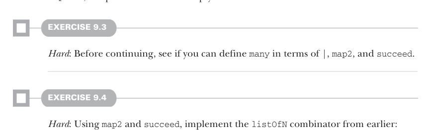

# Страница 0252
[<- Страница 0251](./page-0251) | [Индекс страниц](./) | [Страница 0253 ->](./page-0253)

> Часть 2: Функциональный дизайн и библиотеки комбинаторов / Глава 9: Комбинаторы парсеров / 9.2 Возможная алгебра / 9.2.1 Слайсинг и непустая повторяемость

## 223 9.2 Возможная алгебра

```scala
extension [A](p: Parser[A])
def map2[B, C](p2: Parser[B])(f: (A, B) => C): Parser[C]
```

С `many1` на руках мы теперь можем замутить парсер для нуля или пачки `'a'`, за которыми следует хотя бы одна `'b'`, вот так, лови:


```scala
char('a').many.slice.map(_.size) ** char('b').many1.slice.map(_.size)
```

#### УПРАЖНЕНИЕ 9.2

*Хардкор*: Попробуй сам выдумать законы, которые чётко пропишут поведение `product`.

Теперь, когда у нас есть `map2`, `many` реально примитив или хуйня какая-то? Давай разберём, что эта сука `p.many` творит. Она прогонит `p`, потом снова `p.many`, и так по кругу, пока не обосрётся на попытке спарсить `p`. Все успешные прогоны `p` она накидывает в список. Как только `p` фейлится — бац, и парсер кидает пустой `List`.



#### УПРАЖНЕНИЕ 9.3

*Хардкор*: Прежде чем дальше ломиться, попробуй сам определить `many` через `|`, `map2` и `succeed`.

#### УПРАЖНЕНИЕ 9.4

*Хардкор*: Используя `map2` и `succeed`, реализуй комбинатор `listOfN` из тех времён:

```scala
extension [A](p: Parser[A]) def listOfN(n: Int): Parser[List[A]]
```

Теперь давай попробуем замутить `many`. Вот имплементация через `|`, `map2` и `succeed`:

```scala
extension [A](p: Parser[A]) def many: Parser[List[A]] =
p.map2(p.many)(_ :: _) | succeed(Nil)
```

Код выглядит заебись, чистый, как жопа после биде. `map2` орёт: «Дай мне `p`, потом ещё одну `p.many`, и склеим их результаты через `::` в жирный список». А если облом — то `succeed` с пустячком. Но вот засада, пацаны, подвох чуюёшь? Рекурсивно дёргаем `many` во втором аргументе `map2`, а эта строгая тварь сразу всё вычисляет по полной. Представь упрощённую хрень...

[<- Страница 0251](./page-0251) | [Индекс страниц](./) | [Страница 0253 ->](./page-0253)
