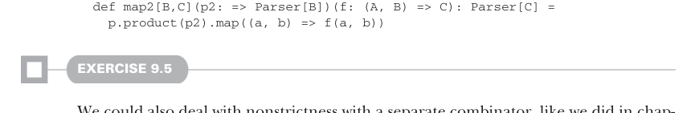

# Страница 0253
[<- Страница 0252](./page-0252) | [Индекс страниц](./) | [Страница 0254 ->](./page-0254)

> Часть 2: Функциональный дизайн и библиотеки комбинаторов / Глава 9: Комбинаторы парсеров / 9.2 Возможная алгебра / 9.2.1 Нарезка и непустые повторения

Следующий шаг оценки `p.many` для какого-нибудь парсера `p`.  
Показываем тут только разворачивание левой ветки `|`:

```scala
p.many
p.map2(p.many)(_ :: _)
p.map2(p.map2(p.many)(_ :: _))(_ :: _)
p.map2(p.map2(p.map2(p.many)(_ :: _))(_ :: _))(_ :: _)
...
```

Потому что любой вызов `map2` всегда жрёт свой второй аргумент наперёд, наша хрень `many` уйдёт в бесконечную рекурсию и сдохнет от стек-оверфлоу (stack overflow), как типичный junior-код без базового случая! Полный пиздец, короче.  
Вывод: `product` и `map2` надо сделать ленивыми по второму аргументу, чтоб не ебались зря:

```scala
extension [A](p: Parser[A])
def product[B](p2: => Parser[B]): Parser[(A, B)]
```



```scala
def map2[B,C](p2: => Parser[B])(f: (A, B) => C): Parser[C] =
p.product(p2).map((a, b) => f(a, b))
```

#### УПРАЖНЕНИЕ 9.5

Можем ещё так разобраться с ленью — через отдельный комбинатор, как в седьмой главе хакали.  
Попробуй щас здесь, подкрути свои комбинаторы под это.  
Как тебе такой подход в этом цирке, а? Я вот думаю, добавляет ли он ясности или просто ещё один слой луковицы?

Теперь наша имплементация `many` должна работать как надо, без сюрпризов.  
По сути, `product` изначально и должен быть ленивым по второму аргументу — если первый `Parser` обосрался, второй даже не запустится, зачем зря жрать ресурсы?  
Короче, у нас теперь солидные комбинаторы: один за другим или пачка одинаковых подряд.  
Но раз уж ковыряемся в ленивости, давай вернёмся к `or` из начала, который мы раньше пропустили:

```scala
extension [A](p: Parser[A]) def or(p2: Parser[A]): Parser[A]
```

Предположим, `or` левосторонне предвзятый (biased) — сначала пробует `p1` на инпуте, а `p2` только если `p1` фейлится.<sup>9</sup>  
Тогда и его стоит сделать ленивым по второму аргументу, который может так и не сдвинуться с мёртвой точки:

```scala
extension [A](p: Parser[A]) infix def or(p2: => Parser[A]): Parser[A]
```

То же самое правим в операторе `|`.

<sup>9</sup> Это чисто дизайнерский выбор, блядь. Подумай о последствиях версии `or`, которая всегда будет гонять оба парсера `p1` и `p2` — как вечеринка, где все приходят, даже если не звали.

[<- Страница 0252](./page-0252) | [Индекс страниц](./) | [Страница 0254 ->](./page-0254)
