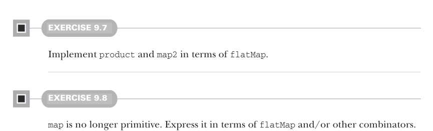
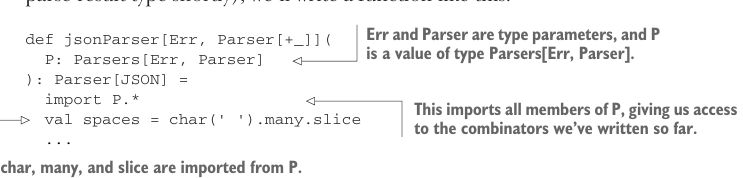
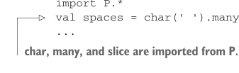

# Страница 0255

[<- Страница 0254](./page-0254) | [Указатель страниц](./) | [Страница 0256 ->](./page-0256)

> Часть 2: Функциональный дизайн и библиотеки комбинаторов / Глава 9: Комбинаторы парсеров / 9.4 Пишем парсер JSON



#### УПРАЖНЕНИЕ 9.7

Реализуйте `product` и `map2` через `flatMap`.

#### УПРАЖНЕНИЕ 9.8

`map` больше не примитив. Выразите его через `flatMap` и/или другие комбинаторы.

Похоже, у нас появился новый примитив — `flatMap`, который позволяет контекстно-зависимое парсинг и даёт реализовать `map` с `map2`. Это не первый раз, когда `flatMap` вылазит на свет божий. Теперь у нас аж целых шесть примитивов в минимальном наборе: `string`, `regex`, `slice`, `succeed`, `or` и `flatMap`. Но при этом мощь выросла — с `flatMap` вместо этих убогих `map` и `product` мы можем жрать не только произвольные контекстно-свободные грамматики вроде JSON, но и контекстно-зависимые, включая те монстры уровня C++ и PERL, от которых мозг в узел завязывается.

### 9.4 Пишем парсер JSON

Давай теперь этот JSON-парсер накатаем, а? Реализации нашей алгебры пока нет, да и комбинаторы для нормальных ошибок не допилили, но хуй с ними, разберёмся потом. Нашему JSON-парсеру похуй на внутренности представления парсеров. Просто функция, которая выдаст JSON-парсер, используя только наши примитивы и производные комбинаторы. То есть, для какого-то типа результата JSON-парсинга (формат JSON и тип результата разберём щас), напишем функцию вот такую:



> Err и Parser — параметры типов, а P — значение типа `Parsers[Err, Parser]`.

```scala
def jsonParser[Err, Parser[+_]](
  P: Parsers[Err, Parser]
): Parser[JSON] =
  import P.*
  val spaces = char(' ').many.slice
  ...
```



> Это импортирует все мемберы из P, давая доступ к комбинаторам, что мы уже накатали.
>
> `char`, `many` и `slice` импортированы из P.

Может показаться, что это какой-то изврат — парсер запустить не сможем, пока не реализуем интерфейс `Parsers` по-живому. Но мы пойдём дальше, потому что в FP это норма: алгебру определяешь, её выразительность ковыряешь, а реализация подождёт. Конкретная имплементация только сковывает, API менять потом — пиздец. Особенно на этапе дизайна либы — алгебру шлифовать в разы проще, не привязываясь к железу.

[<- Страница 0254](./page-0254) | [Указатель страниц](./) | [Страница 0256 ->](./page-0256)
