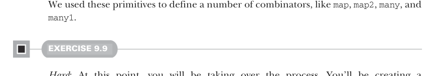

# Страница 0257
[<- Страница 0256](./page-0256) | [Индекс страниц](./) | [Страница 0258 ->](./page-0258)

> Часть 2: Функциональный дизайн и библиотеки комбинаторов / Глава 9: Комбинаторы парсеров / 9.5 Отчёт об ошибках

- `succeed(a)` — всегда успешно отрабатывает и выдаёт значение `a`, как верный солдат на плацу.
- `p.flatMap(f)` — запускает парсер `p`, а потом по его результату выбирает следующий на цепочку, чистый монадический пайплайн в действии.
- `p1` `|` `p2` — пробует `p1`, если тот обосрался — переключается на `p2`, альтернатива как в жизни: план Б наготове.

Мы на этих примитивах наворотили целую кучу комбинаторов — `map`, `map2`, `many`, `many1` и прочие, чтоб не ебаться каждый раз с нуля, как в первый раз на проде.

#### УПРАЖНЕНИЕ 9.9

*Сложное*: Теперь ты рулишь процессом, пацан. Пишешь `Parser[JSON]` с чистого листа, только на наших примитивах. Пока не парься про то, как `Parser` внутри устроен — это потом. По ходу дела сам откопаешь новые комбинаторы, вычешешь повторяющиеся паттерны, факторишь их в отдельные методы. Включай скиллы, что качал всю книгу, и кайфуй от процесса! Застрял — заглядывай в ответы, не стесняйся. Вот минимальный намёк, чтоб не блудить:

- Любые универсальные комбинаторы, что сам придумаешь, лепи прямо в трейт `Parsers`.

- Тебе захочется комбинаторов для токенов JSON — строковые литералы, числа и прочее дерьмо. Бери примитив `regex` (регулярки), что мы раньше мутили. Или добавь свои: `letter` (буквы), `digit` (цифры), `whitespace` (пробелы) — базовый арсенал для токенизаторов.

Хочешь больше подсказок — смотри хинты. Полный JSON-парсер валяется в файле JSON.scala в ответах.

### 9.5 Отчёт об ошибках

До сих пор мы про отчёты об ошибках — ни слова, полный игнор. Копались исключительно в примитивах, чтоб выразить парсеры под любые грамматики, но парсинг грамматики — это полдела. Нам ещё нужно знать, как парсер должен реагировать, когда ему подсунули неожиданную хуйню в инпуте. Даже не зная, как выглядит имплементация `Parsers` (а она может быть любой), мы можем абстрактно порассуждать: какие инфы задают комбинаторы. Ни один из тех, что мы ввели, не говорит ни хуя про то, какое сообщение об ошибке пиздецки выдать при фейле, или что ещё должно быть в `ParseError`. Наши комбинаторы только грамматику описывают да говорят, что с результатом делать при успехе. Если б сейчас сказали "всё, пошли кодить имплементацию", пришлось бы наобум решать про ошибки и их сообщения — а это как лотерея, универсально не прокатит никуда. Я сам через это прошёл: без нормальных стек-трейсов в парсере дебажить — чистый мазохизм, как иголку в стоге сена шарить в темноте после корпора.

[<- Страница 0256](./page-0256) | [Индекс страниц](./) | [Страница 0258 ->](./page-0258)
